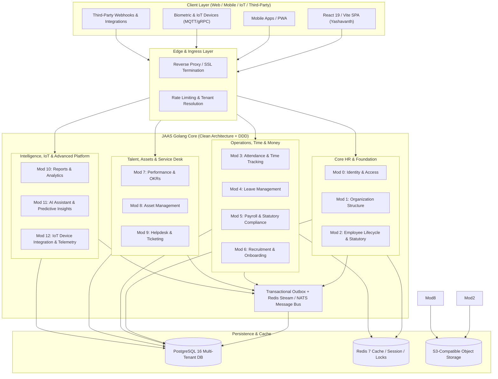
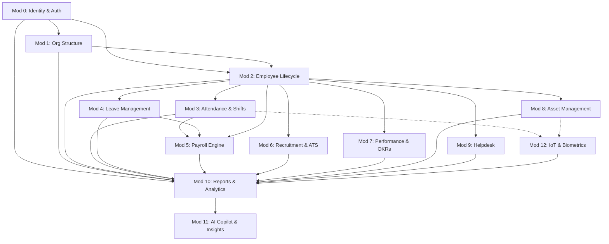
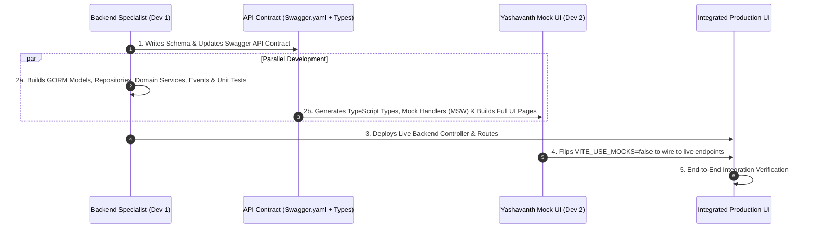

# JAAS (Just Another Admin SaaS) - Comprehensive Enterprise Architecture Masterplan

---

## 1. Executive Summary & Global Architecture Principles

JAAS is an enterprise-grade Human Capital Management (HCM) and Enterprise Operations SaaS platform engineered for multi-tenant scalability, strict data isolation, zero-downtime compliance, and auditability.



### 1.1 Cross-Cutting Architectural Standards
1. **Multi-Tenancy**: Shared database, row-level isolation via compulsory `tenant_id UUID NOT NULL` indexed on every table.
2. **Clean Architecture / DDD**:
   - `domain`: Pure models, custom types, domain validation, domain events.
   - `repository`: SQL/GORM database access interfaces and implementations.
   - `service`: Business logic, transaction management, orchestrating domain events via Outbox.
   - `controller`: HTTP transport handlers, input validation, status mapping.
3. **Response Envelope Convention**:
   - Success: `{"data": {...}, "meta": {"page": 1, "total": 100}}`
   - Error: `{"error": {"code": "RESOURCE_NOT_FOUND", "message": "...", "details": [...]}}`
4. **Resilient Eventing**: Guaranteed at-least-once delivery using the **Transactional Outbox Pattern** with deduplication idempotency keys.
5. **Security & Statutory Privacy**: AES-256-GCM encryption for sensitive columns (Tax IDs, National IDs, Bank Accounts) with deterministic masking (`XXXXXXXX1234`) on client read models.

---

## 2. Granular Module Specifications (Modules 0 to 12)



---

### Module 0: Identity & Access Management (Completed)
- **Primary Purpose**: Foundation of authentication, tenant lifecycle, RBAC/ABAC permissions, OAuth2, and session management.
- **Key Models**: `Tenant`, `User`, `Role`, `Permission`, `UserRole`, `RolePermission`, `UserSession`, `AuditLog`, `OutboxEvent`.
- **Core APIs**: `POST /api/v1/auth/register`, `POST /api/v1/auth/login`, `POST /api/v1/auth/refresh`, `POST /api/v1/auth/logout`, `GET /api/v1/auth/me`, `GET/POST /api/v1/roles`, `GET/POST /api/v1/users`.
- **Domain Events**: `user.created`, `user.authenticated`, `user.deactivated`, `role.updated`.

---

### Module 1: Organization Hierarchy & Departments (Completed)
- **Primary Purpose**: Departmental hierarchies, teams, designations, reporting lines, and org chart visualization.
- **Key Models**: `Department`, `Team`, `Designation`, `EmployeeOrgMapping`, `OrgOutboxEvent`.
- **Core APIs**: `GET/POST /api/v1/departments`, `GET/POST /api/v1/teams`, `GET/POST /api/v1/designations`, `GET /api/v1/org/chart`, `POST /api/v1/org/mappings`.
- **Domain Events**: `department.created`, `department.updated`, `team.assigned`, `reporting_line.changed`.

---

### Module 2: Employee Lifecycle & Statutory Records (Completed)
- **Primary Purpose**: Master employee directory, employment transitions (Onboarding -> Probation -> Active -> Notice -> Terminated), statutory details (PF, ESI, PAN, SSN, Tax PII), document storage, and timeline audits.
- **Key Models**: `Employee`, `EmployeeProfile`, `EmployeeStatutory`, `EmployeeDocument`, `EmployeeTimeline`, `EmployeeOutboxEvent`.
- **Core APIs**: `GET/POST /api/v1/employees`, `GET/PUT /api/v1/employees/:id`, `GET/PUT /api/v1/employees/:id/statutory`, `POST /api/v1/employees/:id/documents`, `GET /api/v1/employees/:id/timeline`.
- **Domain Events**: `employee.created`, `employee.status_changed`, `employee.terminated`, `employee.promoted`.

---

### Module 3: Attendance, Shifts & Time Tracking
- **Primary Purpose**: Geofenced mobile punch, biometric sync, shift schedules, overtime calculations, late mark rules, and monthly timesheet regularization.
- **Database Schema**:
  ```sql
  CREATE TABLE shifts (
      id UUID PRIMARY KEY DEFAULT gen_random_uuid(),
      tenant_id UUID NOT NULL,
      name VARCHAR(100) NOT NULL,
      code VARCHAR(20) NOT NULL,
      start_time TIME NOT NULL,
      end_time TIME NOT NULL,
      grace_period_mins INT DEFAULT 15,
      break_duration_mins INT DEFAULT 60,
      is_night_shift BOOLEAN DEFAULT FALSE,
      created_at TIMESTAMPTZ DEFAULT NOW(),
      updated_at TIMESTAMPTZ DEFAULT NOW()
  );

  CREATE TABLE attendance_records (
      id UUID PRIMARY KEY DEFAULT gen_random_uuid(),
      tenant_id UUID NOT NULL,
      employee_id UUID NOT NULL REFERENCES employees(id),
      shift_id UUID REFERENCES shifts(id),
      date DATE NOT NULL,
      first_punch_in TIMESTAMPTZ,
      last_punch_out TIMESTAMPTZ,
      total_work_minutes INT DEFAULT 0,
      total_break_minutes INT DEFAULT 0,
      overtime_minutes INT DEFAULT 0,
      status VARCHAR(30) NOT NULL, -- PRESENT, ABSENT, HALF_DAY, ON_LEAVE, HOLIDAY, WEEK_OFF
      source VARCHAR(30) DEFAULT 'WEB', -- WEB, MOBILE_GPS, BIOMETRIC_DEVICE, MANUAL_OVERRIDE
      is_regularized BOOLEAN DEFAULT FALSE,
      created_at TIMESTAMPTZ DEFAULT NOW(),
      updated_at TIMESTAMPTZ DEFAULT NOW(),
      CONSTRAINT uq_employee_date UNIQUE(tenant_id, employee_id, date)
  );

  CREATE TABLE attendance_punches (
      id UUID PRIMARY KEY DEFAULT gen_random_uuid(),
      tenant_id UUID NOT NULL,
      attendance_record_id UUID NOT NULL REFERENCES attendance_records(id) ON DELETE CASCADE,
      punch_time TIMESTAMPTZ NOT NULL,
      punch_type VARCHAR(10) NOT NULL, -- IN, OUT
      latitude NUMERIC(10, 8),
      longitude NUMERIC(11, 8),
      device_id VARCHAR(100),
      is_verified BOOLEAN DEFAULT TRUE,
      created_at TIMESTAMPTZ DEFAULT NOW()
  );

  CREATE TABLE timesheet_regularizations (
      id UUID PRIMARY KEY DEFAULT gen_random_uuid(),
      tenant_id UUID NOT NULL,
      employee_id UUID NOT NULL REFERENCES employees(id),
      attendance_record_id UUID NOT NULL REFERENCES attendance_records(id),
      requested_punch_in TIMESTAMPTZ NOT NULL,
      requested_punch_out TIMESTAMPTZ NOT NULL,
      reason TEXT NOT NULL,
      status VARCHAR(30) DEFAULT 'PENDING', -- PENDING, APPROVED, REJECTED
      approver_id UUID REFERENCES employees(id),
      approved_at TIMESTAMPTZ,
      created_at TIMESTAMPTZ DEFAULT NOW()
  );
  ```
- **Core REST APIs**:
  - `POST /api/v1/attendance/punch` (Biometric/Mobile GPS Punch IN/OUT)
  - `GET /api/v1/attendance/my-records` (Employee monthly log)
  - `GET /api/v1/attendance/live-summary` (Admin/Manager real-time presence dashboard)
  - `POST /api/v1/attendance/regularize` (Regularization request)
  - `PUT /api/v1/attendance/regularize/:id/action` (Approve/Reject regularization)
  - `GET/POST /api/v1/shifts` (CRUD Shifts & Rotas)
- **Domain Events**: `attendance.punched_in`, `attendance.punched_out`, `attendance.regularization_requested`, `attendance.regularization_approved`.

---

### Module 4: Leave & Absence Management
- **Primary Purpose**: Configurable leave policy engine (Earned Leave, Sick Leave, Casual, Maternity/Paternity), multi-tier approval workflows, accrual engines, sandwich rule evaluations, and holiday calendars.
- **Database Schema**:
  ```sql
  CREATE TABLE leave_types (
      id UUID PRIMARY KEY DEFAULT gen_random_uuid(),
      tenant_id UUID NOT NULL,
      name VARCHAR(50) NOT NULL,
      code VARCHAR(10) NOT NULL,
      is_paid BOOLEAN DEFAULT TRUE,
      annual_allowance NUMERIC(5,2) NOT NULL,
      carry_forward_limit NUMERIC(5,2) DEFAULT 0,
      requires_proof BOOLEAN DEFAULT FALSE,
      applicable_gender VARCHAR(20) DEFAULT 'ALL',
      created_at TIMESTAMPTZ DEFAULT NOW()
  );

  CREATE TABLE leave_balances (
      id UUID PRIMARY KEY DEFAULT gen_random_uuid(),
      tenant_id UUID NOT NULL,
      employee_id UUID NOT NULL REFERENCES employees(id),
      leave_type_id UUID NOT NULL REFERENCES leave_types(id),
      year INT NOT NULL,
      accrued NUMERIC(5,2) DEFAULT 0,
      used NUMERIC(5,2) DEFAULT 0,
      reserved NUMERIC(5,2) DEFAULT 0,
      balance NUMERIC(5,2) GENERATED ALWAYS AS (accrued - used - reserved) STORED,
      updated_at TIMESTAMPTZ DEFAULT NOW(),
      CONSTRAINT uq_emp_leave_year UNIQUE(tenant_id, employee_id, leave_type_id, year)
  );

  CREATE TABLE leave_requests (
      id UUID PRIMARY KEY DEFAULT gen_random_uuid(),
      tenant_id UUID NOT NULL,
      employee_id UUID NOT NULL REFERENCES employees(id),
      leave_type_id UUID NOT NULL REFERENCES leave_types(id),
      start_date DATE NOT NULL,
      end_date DATE NOT NULL,
      is_half_day BOOLEAN DEFAULT FALSE,
      half_day_type VARCHAR(10), -- FIRST_HALF, SECOND_HALF
      total_days NUMERIC(4,1) NOT NULL,
      reason TEXT NOT NULL,
      attachment_url VARCHAR(500),
      status VARCHAR(30) DEFAULT 'PENDING', -- PENDING, APPROVED, REJECTED, CANCELLED
      current_approver_id UUID REFERENCES employees(id),
      rejection_reason TEXT,
      created_at TIMESTAMPTZ DEFAULT NOW(),
      updated_at TIMESTAMPTZ DEFAULT NOW()
  );

  CREATE TABLE holiday_calendars (
      id UUID PRIMARY KEY DEFAULT gen_random_uuid(),
      tenant_id UUID NOT NULL,
      name VARCHAR(100) NOT NULL,
      date DATE NOT NULL,
      is_optional BOOLEAN DEFAULT FALSE,
      description TEXT,
      created_at TIMESTAMPTZ DEFAULT NOW()
  );
  ```
- **Core REST APIs**:
  - `GET /api/v1/leaves/balances` (My Balances)
  - `POST /api/v1/leaves/requests` (Apply for leave)
  - `GET /api/v1/leaves/requests` (My applications + Team approvals)
  - `PUT /api/v1/leaves/requests/:id/action` (Approve/Reject)
  - `POST /api/v1/leaves/requests/:id/cancel` (Cancel approved/pending leave)
  - `GET/POST /api/v1/leaves/policies` (Admin policy config)
- **Domain Events**: `leave.applied`, `leave.approved`, `leave.rejected`, `leave.cancelled`, `leave.accrued`.

---

### Module 5: Payroll & Statutory Compliance
- **Primary Purpose**: Complete salary structure designer (CTC breakdown, basic, HRA, allowances, deductions), monthly payroll generation run, statutory calculations (Provident Fund, ESI, TDS/Income Tax, Professional Tax), payslip PDF generation, and bank payout file exports.
- **Database Schema**:
  ```sql
  CREATE TABLE salary_structures (
      id UUID PRIMARY KEY DEFAULT gen_random_uuid(),
      tenant_id UUID NOT NULL,
      name VARCHAR(100) NOT NULL,
      description TEXT,
      is_active BOOLEAN DEFAULT TRUE,
      created_at TIMESTAMPTZ DEFAULT NOW()
  );

  CREATE TABLE salary_components (
      id UUID PRIMARY KEY DEFAULT gen_random_uuid(),
      tenant_id UUID NOT NULL,
      structure_id UUID NOT NULL REFERENCES salary_structures(id) ON DELETE CASCADE,
      name VARCHAR(100) NOT NULL,
      type VARCHAR(20) NOT NULL, -- EARNING, DEDUCTION, STATUTORY
      calculation_type VARCHAR(20) NOT NULL, -- FLAT, PERCENTAGE_OF_BASIC, FORMULA
      percentage NUMERIC(5,2),
      is_taxable BOOLEAN DEFAULT TRUE,
      is_statutory BOOLEAN DEFAULT FALSE
  );

  CREATE TABLE employee_salary_assignments (
      id UUID PRIMARY KEY DEFAULT gen_random_uuid(),
      tenant_id UUID NOT NULL,
      employee_id UUID NOT NULL REFERENCES employees(id),
      structure_id UUID NOT NULL REFERENCES salary_structures(id),
      annual_ctc NUMERIC(12,2) NOT NULL,
      effective_from DATE NOT NULL,
      is_current BOOLEAN DEFAULT TRUE,
      created_at TIMESTAMPTZ DEFAULT NOW()
  );

  CREATE TABLE payroll_runs (
      id UUID PRIMARY KEY DEFAULT gen_random_uuid(),
      tenant_id UUID NOT NULL,
      month INT NOT NULL,
      year INT NOT NULL,
      total_employees INT NOT NULL,
      gross_disbursement NUMERIC(15,2) NOT NULL,
      net_disbursement NUMERIC(15,2) NOT NULL,
      status VARCHAR(30) DEFAULT 'DRAFT', -- DRAFT, CALCULATED, APPROVED, PROCESSED, LOCKED
      processed_by UUID REFERENCES employees(id),
      created_at TIMESTAMPTZ DEFAULT NOW()
  );

  CREATE TABLE payslips (
      id UUID PRIMARY KEY DEFAULT gen_random_uuid(),
      tenant_id UUID NOT NULL,
      payroll_run_id UUID NOT NULL REFERENCES payroll_runs(id) ON DELETE CASCADE,
      employee_id UUID NOT NULL REFERENCES employees(id),
      basic NUMERIC(10,2) NOT NULL,
      hra NUMERIC(10,2) NOT NULL,
      allowances JSONB NOT NULL,
      gross_earnings NUMERIC(10,2) NOT NULL,
      pf_deduction NUMERIC(10,2) DEFAULT 0,
      esi_deduction NUMERIC(10,2) DEFAULT 0,
      tax_deduction NUMERIC(10,2) DEFAULT 0,
      other_deductions JSONB NOT NULL,
      total_deductions NUMERIC(10,2) NOT NULL,
      net_pay NUMERIC(10,2) NOT NULL,
      payable_days NUMERIC(4,1) NOT NULL,
      loss_of_pay_days NUMERIC(4,1) DEFAULT 0,
      pdf_url VARCHAR(500),
      created_at TIMESTAMPTZ DEFAULT NOW()
  );
  ```
- **Core REST APIs**:
  - `GET/POST /api/v1/payroll/structures` (Salary templates)
  - `POST /api/v1/payroll/assign` (Assign CTC to employee)
  - `POST /api/v1/payroll/runs/execute` (Trigger monthly run calculation)
  - `GET /api/v1/payroll/runs/:id` (Review calculated payroll run)
  - `PUT /api/v1/payroll/runs/:id/finalize` (Lock and generate payslips)
  - `GET /api/v1/payroll/payslips/my-payslips` (Employee payslip download)
- **Domain Events**: `payroll.run_initiated`, `payroll.calculated`, `payroll.disbursed`, `payslip.generated`.

---

### Module 6: Recruitment & Applicant Tracking (ATS)
- **Primary Purpose**: Job requisitions, career portal job postings, candidate resume ingestion/parsing, pipeline stage tracking (Screening -> Tech 1 -> HR -> Offer -> Hired), interview scheduling, and automatic conversion to Employee (Module 2).
- **Database Schema**:
  ```sql
  CREATE TABLE job_openings (
      id UUID PRIMARY KEY DEFAULT gen_random_uuid(),
      tenant_id UUID NOT NULL,
      title VARCHAR(150) NOT NULL,
      department_id UUID REFERENCES departments(id),
      designation_id UUID REFERENCES designations(id),
      headcount INT DEFAULT 1,
      min_experience_years INT DEFAULT 0,
      location VARCHAR(100),
      employment_type VARCHAR(30) DEFAULT 'FULL_TIME',
      job_description TEXT NOT NULL,
      status VARCHAR(30) DEFAULT 'OPEN', -- DRAFT, OPEN, ON_HOLD, FILLED, CLOSED
      created_at TIMESTAMPTZ DEFAULT NOW()
  );

  CREATE TABLE candidates (
      id UUID PRIMARY KEY DEFAULT gen_random_uuid(),
      tenant_id UUID NOT NULL,
      job_opening_id UUID NOT NULL REFERENCES job_openings(id),
      first_name VARCHAR(100) NOT NULL,
      last_name VARCHAR(100) NOT NULL,
      email VARCHAR(150) NOT NULL,
      phone VARCHAR(30),
      resume_url VARCHAR(500) NOT NULL,
      stage VARCHAR(30) DEFAULT 'SOURCED', -- SOURCED, SCREENING, INTERVIEW, OFFERED, HIRED, REJECTED
      score INT DEFAULT 0,
      expected_ctc NUMERIC(12,2),
      notice_period_days INT,
      created_at TIMESTAMPTZ DEFAULT NOW()
  );

  CREATE TABLE candidate_interviews (
      id UUID PRIMARY KEY DEFAULT gen_random_uuid(),
      tenant_id UUID NOT NULL,
      candidate_id UUID NOT NULL REFERENCES candidates(id) ON DELETE CASCADE,
      round_name VARCHAR(100) NOT NULL,
      interviewer_id UUID NOT NULL REFERENCES employees(id),
      scheduled_at TIMESTAMPTZ NOT NULL,
      meeting_link VARCHAR(500),
      feedback TEXT,
      rating INT CHECK (rating >= 1 AND rating <= 5),
      recommendation VARCHAR(20), -- STRONG_HIRE, HIRE, HOLD, REJECT
      status VARCHAR(20) DEFAULT 'SCHEDULED' -- SCHEDULED, COMPLETED, CANCELLED
  );

  CREATE TABLE job_offers (
      id UUID PRIMARY KEY DEFAULT gen_random_uuid(),
      tenant_id UUID NOT NULL,
      candidate_id UUID NOT NULL REFERENCES candidates(id),
      offered_ctc NUMERIC(12,2) NOT NULL,
      joining_date DATE NOT NULL,
      status VARCHAR(30) DEFAULT 'OFFERED', -- OFFERED, ACCEPTED, DECLINED, WITHDRAWN
      offer_letter_url VARCHAR(500),
      created_at TIMESTAMPTZ DEFAULT NOW()
  );
  ```
- **Core REST APIs**:
  - `GET/POST /api/v1/recruitment/jobs` (Job management)
  - `GET/POST /api/v1/recruitment/candidates` (Candidate ingestion)
  - `PUT /api/v1/recruitment/candidates/:id/stage` (Move pipeline stage)
  - `POST /api/v1/recruitment/interviews` (Schedule interview & record feedback)
  - `POST /api/v1/recruitment/candidates/:id/convert-to-employee` (Triggers Mod 2 onboarding)
- **Domain Events**: `recruitment.job_published`, `recruitment.candidate_applied`, `recruitment.interview_scheduled`, `recruitment.candidate_hired`.

---

### Module 7: Performance Management & OKRs
- **Primary Purpose**: Quarterly/Annual review cycles, OKRs & goal cascading, 360-degree peer reviews, continuous check-ins, and 9-box talent matrix.
- **Database Schema**:
  ```sql
  CREATE TABLE appraisal_cycles (
      id UUID PRIMARY KEY DEFAULT gen_random_uuid(),
      tenant_id UUID NOT NULL,
      title VARCHAR(150) NOT NULL,
      start_date DATE NOT NULL,
      end_date DATE NOT NULL,
      status VARCHAR(30) DEFAULT 'UPCOMING', -- UPCOMING, ACTIVE, REVIEW_STAGE, COMPLETED
      created_at TIMESTAMPTZ DEFAULT NOW()
  );

  CREATE TABLE goals (
      id UUID PRIMARY KEY DEFAULT gen_random_uuid(),
      tenant_id UUID NOT NULL,
      employee_id UUID NOT NULL REFERENCES employees(id),
      cycle_id UUID REFERENCES appraisal_cycles(id),
      title VARCHAR(200) NOT NULL,
      description TEXT,
      weightage NUMERIC(5,2) DEFAULT 10.0,
      progress NUMERIC(5,2) DEFAULT 0.0, -- 0 - 100%
      status VARCHAR(30) DEFAULT 'IN_PROGRESS',
      created_at TIMESTAMPTZ DEFAULT NOW()
  );

  CREATE TABLE appraisal_reviews (
      id UUID PRIMARY KEY DEFAULT gen_random_uuid(),
      tenant_id UUID NOT NULL,
      cycle_id UUID NOT NULL REFERENCES appraisal_cycles(id),
      employee_id UUID NOT NULL REFERENCES employees(id),
      reviewer_id UUID NOT NULL REFERENCES employees(id),
      review_type VARCHAR(30) NOT NULL, -- SELF, MANAGER, PEER, SUBORDINATE
      ratings JSONB NOT NULL,
      strengths TEXT,
      improvements TEXT,
      overall_score NUMERIC(3,2),
      status VARCHAR(30) DEFAULT 'PENDING',
      submitted_at TIMESTAMPTZ
  );
  ```
- **Core REST APIs**:
  - `GET/POST /api/v1/performance/cycles`
  - `GET/POST /api/v1/performance/goals`
  - `PUT /api/v1/performance/goals/:id/progress`
  - `GET/POST /api/v1/performance/reviews`
  - `GET /api/v1/performance/analytics/matrix-9box`
- **Domain Events**: `performance.cycle_started`, `performance.goal_updated`, `performance.review_submitted`.

---

### Module 8: Asset Lifecycle & Inventory Management
- **Primary Purpose**: IT & physical assets registry, hardware specs, procurement depreciation, assignment & handovers, asset maintenance/repair logs, and return checks during employee exit.
- **Database Schema**:
  ```sql
  CREATE TABLE asset_categories (
      id UUID PRIMARY KEY DEFAULT gen_random_uuid(),
      tenant_id UUID NOT NULL,
      name VARCHAR(100) NOT NULL,
      code VARCHAR(20) NOT NULL,
      useful_life_months INT DEFAULT 36
  );

  CREATE TABLE assets (
      id UUID PRIMARY KEY DEFAULT gen_random_uuid(),
      tenant_id UUID NOT NULL,
      category_id UUID NOT NULL REFERENCES asset_categories(id),
      asset_tag VARCHAR(50) NOT NULL UNIQUE,
      name VARCHAR(150) NOT NULL,
      serial_number VARCHAR(100) NOT NULL,
      purchase_date DATE,
      purchase_cost NUMERIC(12,2),
      warranty_expiry DATE,
      status VARCHAR(30) DEFAULT 'AVAILABLE', -- AVAILABLE, ALLOCATED, IN_REPAIR, RETIRED, LOST
      current_holder_id UUID REFERENCES employees(id),
      qr_code_url VARCHAR(500),
      created_at TIMESTAMPTZ DEFAULT NOW()
  );

  CREATE TABLE asset_allocations (
      id UUID PRIMARY KEY DEFAULT gen_random_uuid(),
      tenant_id UUID NOT NULL,
      asset_id UUID NOT NULL REFERENCES assets(id),
      employee_id UUID NOT NULL REFERENCES employees(id),
      allocated_at TIMESTAMPTZ DEFAULT NOW(),
      returned_at TIMESTAMPTZ,
      condition_on_allocation VARCHAR(50) DEFAULT 'NEW',
      condition_on_return VARCHAR(50),
      allocated_by UUID REFERENCES employees(id)
  );
  ```
- **Core REST APIs**:
  - `GET/POST /api/v1/assets`
  - `POST /api/v1/assets/allocate`
  - `POST /api/v1/assets/return`
  - `GET /api/v1/assets/my-assets` (Employee inventory)
  - `GET /api/v1/assets/qr/:assetTag`
- **Domain Events**: `asset.allocated`, `asset.returned`, `asset.sent_for_repair`.

---

### Module 9: Enterprise Helpdesk & Service Ticketing
- **Primary Purpose**: Internal ticketing (IT, HR, Facilities, Finance), SLA breach timers, multi-tier escalation, canned responses, internal notes, and employee satisfaction (CSAT) scoring.
- **Database Schema**:
  ```sql
  CREATE TABLE ticket_categories (
      id UUID PRIMARY KEY DEFAULT gen_random_uuid(),
      tenant_id UUID NOT NULL,
      name VARCHAR(100) NOT NULL,
      department_id UUID REFERENCES departments(id),
      default_sla_hours INT DEFAULT 24
  );

  CREATE TABLE tickets (
      id UUID PRIMARY KEY DEFAULT gen_random_uuid(),
      tenant_id UUID NOT NULL,
      ticket_number VARCHAR(30) NOT NULL UNIQUE,
      category_id UUID NOT NULL REFERENCES ticket_categories(id),
      requester_id UUID NOT NULL REFERENCES employees(id),
      assignee_id UUID REFERENCES employees(id),
      title VARCHAR(200) NOT NULL,
      description TEXT NOT NULL,
      priority VARCHAR(20) DEFAULT 'MEDIUM', -- LOW, MEDIUM, HIGH, URGENT
      status VARCHAR(30) DEFAULT 'OPEN', -- OPEN, IN_PROGRESS, WAITING_ON_USER, RESOLVED, CLOSED
      sla_due_at TIMESTAMPTZ NOT NULL,
      resolved_at TIMESTAMPTZ,
      csat_rating INT CHECK (csat_rating >= 1 AND csat_rating <= 5),
      created_at TIMESTAMPTZ DEFAULT NOW()
  );

  CREATE TABLE ticket_comments (
      id UUID PRIMARY KEY DEFAULT gen_random_uuid(),
      tenant_id UUID NOT NULL,
      ticket_id UUID NOT NULL REFERENCES tickets(id) ON DELETE CASCADE,
      author_id UUID NOT NULL REFERENCES employees(id),
      message TEXT NOT NULL,
      is_internal_note BOOLEAN DEFAULT FALSE,
      created_at TIMESTAMPTZ DEFAULT NOW()
  );
  ```
- **Core REST APIs**:
  - `GET/POST /api/v1/helpdesk/tickets`
  - `GET /api/v1/helpdesk/tickets/:id`
  - `POST /api/v1/helpdesk/tickets/:id/comments`
  - `PUT /api/v1/helpdesk/tickets/:id/assign`
  - `PUT /api/v1/helpdesk/tickets/:id/resolve`
- **Domain Events**: `ticket.created`, `ticket.assigned`, `ticket.sla_breached`, `ticket.resolved`.

---

### Module 10: Reports, BI & Audit Analytics Engine
- **Primary Purpose**: Cross-module analytical queries, turnover rate calculations, attendance compliance heatmap, payroll expenditure breakdowns, scheduled automated CSV/PDF reporting, and audit logs.
- **Database Schema**:
  ```sql
  CREATE TABLE custom_reports (
      id UUID PRIMARY KEY DEFAULT gen_random_uuid(),
      tenant_id UUID NOT NULL,
      name VARCHAR(150) NOT NULL,
      module VARCHAR(50) NOT NULL,
      query_config JSONB NOT NULL,
      schedule_cron VARCHAR(50),
      recipient_emails TEXT[],
      created_by UUID REFERENCES employees(id),
      created_at TIMESTAMPTZ DEFAULT NOW()
  );
  ```
- **Core REST APIs**:
  - `GET /api/v1/analytics/headcount-trends`
  - `GET /api/v1/analytics/attendance-matrix`
  - `GET /api/v1/analytics/payroll-liability`
  - `POST /api/v1/analytics/export/:reportType` (CSV / XLSX / PDF)

---

### Module 11: AI Assistant & Predictive Insights
- **Primary Purpose**: Natural Language HR Assistant, automated resume screening & semantic match scoring, attrition risk prediction, and automated meeting summarization.
- **Database Schema**:
  ```sql
  CREATE TABLE ai_conversations (
      id UUID PRIMARY KEY DEFAULT gen_random_uuid(),
      tenant_id UUID NOT NULL,
      user_id UUID NOT NULL REFERENCES users(id),
      session_title VARCHAR(100),
      created_at TIMESTAMPTZ DEFAULT NOW()
  );

  CREATE TABLE ai_messages (
      id UUID PRIMARY KEY DEFAULT gen_random_uuid(),
      conversation_id UUID NOT NULL REFERENCES ai_conversations(id) ON DELETE CASCADE,
      role VARCHAR(20) NOT NULL, -- USER, ASSISTANT, SYSTEM
      content TEXT NOT NULL,
      tokens_used INT DEFAULT 0,
      created_at TIMESTAMPTZ DEFAULT NOW()
  );

  CREATE TABLE attrition_risk_scores (
      id UUID PRIMARY KEY DEFAULT gen_random_uuid(),
      tenant_id UUID NOT NULL,
      employee_id UUID NOT NULL REFERENCES employees(id),
      risk_percentage NUMERIC(5,2) NOT NULL,
      key_factors JSONB NOT NULL,
      analyzed_at TIMESTAMPTZ DEFAULT NOW()
  );
  ```
- **Core REST APIs**:
  - `POST /api/v1/ai/chat` (Streaming HR assistant)
  - `POST /api/v1/ai/screen-resume` (Resume vs Job scoring)
  - `GET /api/v1/ai/attrition-risk` (HR Manager dashboard)

---

### Module 12: IoT Device Integration & Biometrics Telemetry
- **Primary Purpose**: Biometric punch integration (ZKTeco, eSSL, Hikvision), RFID access gates, real-time MQTT broker listeners, device health heartbeats, and device command dispatch (sync user / remote unlock).
- **Database Schema**:
  ```sql
  CREATE TABLE iot_devices (
      id UUID PRIMARY KEY DEFAULT gen_random_uuid(),
      tenant_id UUID NOT NULL,
      device_serial VARCHAR(100) NOT NULL UNIQUE,
      name VARCHAR(100) NOT NULL,
      device_type VARCHAR(50) NOT NULL, -- BIOMETRIC_ATTENDANCE, RFID_DOOR, BLE_BEACON
      ip_address VARCHAR(50),
      mac_address VARCHAR(50),
      status VARCHAR(20) DEFAULT 'OFFLINE', -- ONLINE, OFFLINE, ERROR
      last_heartbeat TIMESTAMPTZ,
      location VARCHAR(100),
      auth_token VARCHAR(255) NOT NULL,
      created_at TIMESTAMPTZ DEFAULT NOW()
  );

  CREATE TABLE iot_telemetry_logs (
      id UUID PRIMARY KEY DEFAULT gen_random_uuid(),
      tenant_id UUID NOT NULL,
      device_id UUID NOT NULL REFERENCES iot_devices(id),
      event_type VARCHAR(50) NOT NULL, -- PUNCH, HEARTBEAT, TAMPER_ALERT, ACCESS_DENIED
      payload JSONB NOT NULL,
      created_at TIMESTAMPTZ DEFAULT NOW()
  );
  ```
- **Core REST APIs & Protocols**:
  - `POST /api/v1/iot/devices/register`
  - `POST /api/v1/iot/telemetry/punch` (Device webhook/push endpoint)
  - `GET /api/v1/iot/devices/health`
  - `POST /api/v1/iot/devices/:id/sync-users` (Push employee biometric templates)

---

## 3. Two-Person Implementation Blueprint (Backend Specialist & Yashavanth - Frontend)

### 3.1 Collaboration Workflow & Contract First Lifecycle
To maximize parallel speed and prevent blockers, development uses a **Contract-First Lifecycle**:



---

### 3.2 Phased Delivery & Parallelization Schedule

| Phase | Developer 1 (Backend Core) | Developer 2 (Yashavanth - Frontend) | Parallel Factor |
| :--- | :--- | :--- | :--- |
| **Phase 1 (Completed)** | **Module 0 (Identity)**<br>**Module 1 (Org Structure)**<br>**Module 2 (Employee Core)** | **Build UI Shell & Base Layout**<br>- Auth (Login, Register, MFA)<br>- Org Chart Interactive Tree<br>- Employee Directory & Profile Views | Completed / In-Sync |
| **Phase 2 (Ops & Time)** | **Module 3 (Attendance & Shifts)**<br>- GPS Punch, Timesheet calculations, Regularization engine<br>**Module 4 (Leave Management)**<br>- Policy engine, balance ledger, multi-tier approvals | **Build Time & Absence UI**<br>- Clock-in / Out Widget & Geolocation<br>- Monthly Timesheet Grid & Regularize Modal<br>- Leave Application Form & Approver Dashboard | **100% Parallel** (Backend generates Swagger DTOs first, Frontend builds with mock data) |
| **Phase 3 (Money & Talent)** | **Module 5 (Payroll Engine)**<br>- Structure designer, TDS/PF math, payslip generator<br>**Module 6 (Recruitment & ATS)**<br>- Job openings, resume parser, candidate stages | **Build Finance & ATS UI**<br>- Salary Structure Designer & Run Wizard<br>- Employee Payslip PDF Viewer<br>- Kanban Board for ATS Candidate Pipeline | **100% Parallel** |
| **Phase 4 (Engagement)** | **Module 7 (Performance & OKRs)**<br>- Goal tracking, 360 review submission<br>**Module 8 (Asset Management)**<br>- Inventory tracking, QR code generation, allocation | **Build Talent & Assets UI**<br>- OKR Tree & 360 Feedback Forms<br>- Asset Inventory Table with QR scanner modal | **100% Parallel** |
| **Phase 5 (Service & Hardware)**| **Module 9 (Helpdesk)**<br>- Ticket SLAs, comment threads<br>**Module 12 (IoT Devices)**<br>- Biometric MQTT/Webhook listeners, device health | **Build Helpdesk & Device UI**<br>- Service Desk Ticket Kanban & Chat Thread<br>- IoT Device Manager & Live Status Telemetry | **100% Parallel** |
| **Phase 6 (Intelligence & BI)**| **Module 10 (Reports & Analytics)**<br>- Dynamic SQL query generator, CSV/PDF export<br>**Module 11 (AI Copilot)**<br>- Streaming LLM chat, attrition predictor | **Build Analytics & AI UI**<br>- Executive KPI Dashboards & Chart Widgets<br>- Floating AI Assistant Chat Drawer | **100% Parallel** |

---

### 3.3 Yashavanth's Mock-to-Live Frontend Pattern

For every module, Yashavanth creates mock data conforming to the standard `{data, meta}` envelope:

```typescript
// src/mocks/handlers/attendance.ts
import { http, HttpResponse } from 'msw';

export const attendanceHandlers = [
  http.get('/api/v1/attendance/my-records', ({ request }) => {
    return HttpResponse.json({
      data: [
        {
          id: '550e8400-e29b-41d4-a716-446655440000',
          date: '2026-10-05',
          first_punch_in: '2026-10-05T09:02:15Z',
          last_punch_out: '2026-10-05T18:05:30Z',
          total_work_minutes: 543,
          status: 'PRESENT',
          source: 'WEB'
        }
      ],
      meta: { total: 1 }
    });
  }),
  
  http.post('/api/v1/attendance/punch', async ({ request }) => {
    const body = await request.json() as { type: 'IN' | 'OUT'; latitude?: number; longitude?: number };
    return HttpResponse.json({
      data: {
        punch_time: new Date().toISOString(),
        punch_type: body.type,
        status: 'ACCEPTED'
      }
    }, { status: 201 });
  })
];
```

When Backend pushes live controllers, setting `VITE_USE_MOCKS=false` immediately switches the UI to production API calls without altering application code.

---

## 4. Verification & Testing Matrix

Every backend module implements:
1. **Unit Tests**: Domain entities, calculations (e.g. salary deductions, overtime hours, leave balances), and service validation rules.
2. **Integration Tests**: In-memory / containerized PostgreSQL repository CRUD and transactional integrity.
3. **Outbox Tests**: Verification that domain events are written atomically within the same database transaction.
4. **Code Quality**: Zero linter issues via `go vet` and `gofmt`, zero orphaned `TODO` comments, and strict Clean Architecture dependency flow.
