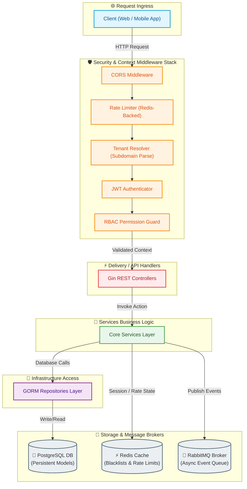
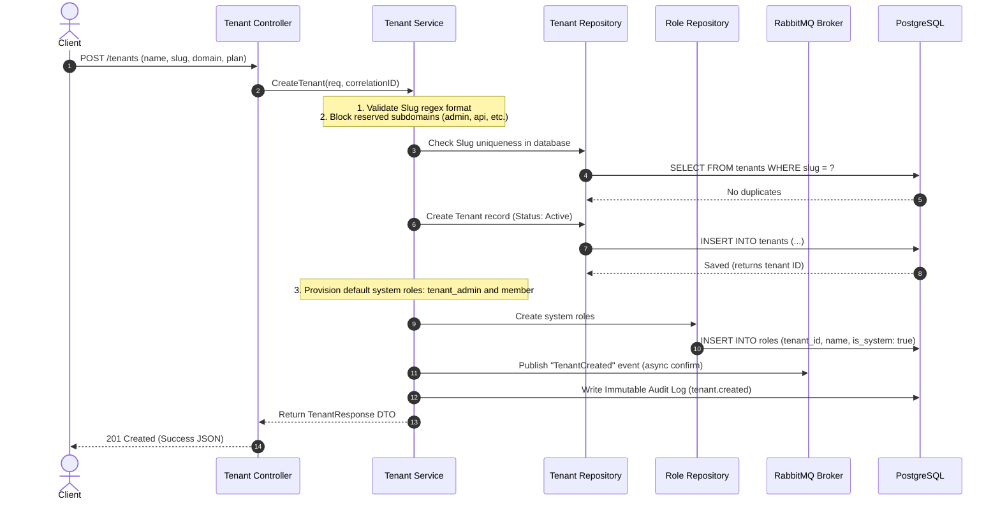
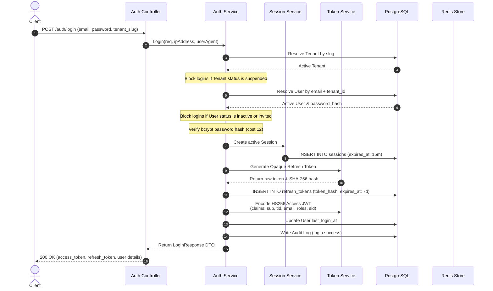
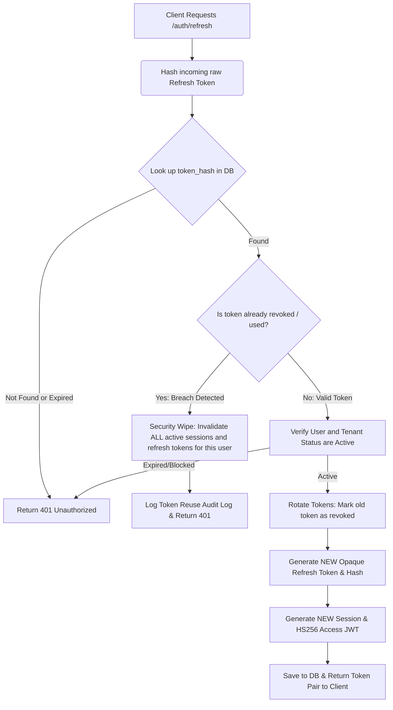

# Module 0 — Architecture & Workflows Report

> [!TIP]
> * An editable **Draw.io** version of this architecture diagram is saved locally in this repository at [architecture.drawio](file:///c:/Users/yashwanth/Desktop/_AJASS/docs/modules/module-0-identity/architecture.drawio).
> * The raw **Mermaid** text file is saved at [architecture.mermaid](file:///c:/Users/yashwanth/Desktop/_AJASS/docs/modules/module-0-identity/architecture.mermaid). You can copy the code into any Mermaid renderer or online live editor.

This document provides a clean architectural overview, detailed system workflows, and technical rationales for **Module 0 (Tenant + Identity + RBAC)** foundation of the JAAS platform.

---

## 1. Clean Architectural Diagram

The system is designed following **Clean Architecture** principles. Dependencies flow inward: HTTP and infrastructure layers depend on services, which depend on repositories and domain models.

---

## 2. Core Workflows

### A. Tenant Signup & Onboarding Workflow

This flow ensures new organizations register cleanly with automatic system roles provisioned.

---

### B. User Signin & Authentication Workflow

This flow authenticates users, starts active sessions, and deploys security tokens (JWT + Opaque Refresh).

---

### C. Refresh Token Rotation & Reuse Detection (RT-005)

To prevent session hijacks, we rotate refresh tokens on every use and implement absolute reuse detection.

---

## 3. Technology Stack Rationale

### A. Why Redis?
1. **Low-Latency Session Verification**: Rather than hitting PostgreSQL on every API call to confirm a user's session validity, the [auth](file:///c:/Users/yashwanth/Desktop/_AJASS/backend/internal/identity/middleware/auth.go) middleware queries Redis for blacklisted sessions.
2. **Instant JWT Blacklisting**: On logout, access tokens cannot be deleted from a client's device, so their `sid` (session ID) is blacklisted in Redis with a 15-minute TTL (matching access token expiration), resolving stateless logout invalidation.
3. **High-Performance Counters**: Sliding window rate limits require fast memory operations that Redis handles natively via atomic key incrementation.

### B. Why RabbitMQ?
1. **Decoupled Architecture**: When a tenant or user is created, notifications (emails, SMS) or downstream sync services need to run. RabbitMQ allows the Identity service to publish a lightweight event and exit immediately without waiting for secondary processes.
2. **Reliability & Eventual Consistency**: RabbitMQ features **Publish Confirms** and durable queues. If downstream services (e.g. notification consumer) are down, events are safe in the broker and processed as soon as consumers reconnect.
3. **Asynchronous Audit Scopes**: Immutable security audit logs are written to the database asynchronously via events queue consumers, protecting the primary API thread from DB write latencies.

### C. Why Rate Limiters?
1. **Brute-Force Attack Prevention**: Limits access to critical authorization endpoints (`/auth/login`, `/auth/forgot-password`). Brute-forcing passwords is capped at 10 requests per 15 minutes, blocking bots.
2. **Resource Exhaustion Mitigations**: Prevents bad actors from spawning high volumes of costly cryptographic actions (like Bcrypt password hashes which run at work cost 12, taking significant CPU cycles).
3. **Fail-Safe Fallback**: If Redis experiences connection outages, the rate limiter middleware is designed to **fail-open**—logging warning signals but allowing legitimate requests to bypass, prioritizing platform availability.
