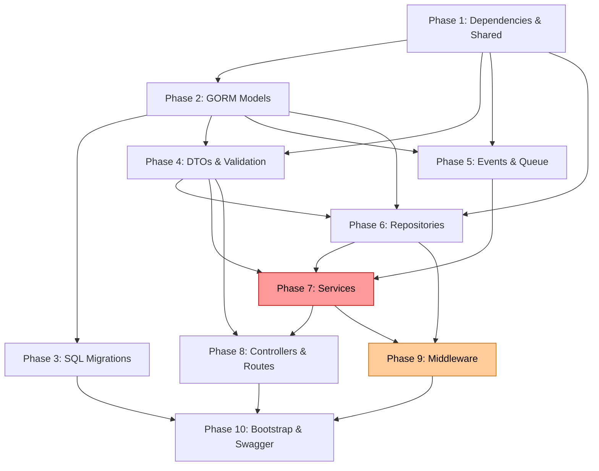

# Module 0 — Implementation Roadmap

This roadmap transforms the approved Module 0 specification into a sequenced execution plan. Each phase is independently compilable, testable, and deployable. Phases must be executed in order. Each phase produces a commit-ready increment.

---

## Roadmap Summary

```
Phase 1  ▸ Go Dependencies & Shared Infrastructure       ~1.5 hours
Phase 2  ▸ GORM Domain Models                            ~3 hours
Phase 3  ▸ SQL Migrations                                ~2 hours
Phase 4  ▸ DTOs, Validation & Error Types                ~2.5 hours
Phase 5  ▸ Event Definitions & Queue Interfaces           ~1 hour
Phase 6  ▸ Repository Interfaces & Implementations        ~4 hours
Phase 7  ▸ Service Layer                                  ~8 hours
Phase 8  ▸ Controllers & Route Registration               ~4 hours
Phase 9  ▸ Middleware Stack                               ~4 hours
Phase 10 ▸ Module Bootstrap, Swagger & Integration Wiring ~2 hours
                                                    ─────────────
                                             Total:  ~32 hours
```



```mermaid
gantt
    title Module 0 Implementation Phases
    dateFormat  X
    axisFormat %s

    section Foundation
    Phase 1 - Dependencies & Shared    :p1, 0, 1.5h
    Phase 2 - GORM Models              :p2, after p1, 3h
    Phase 3 - SQL Migrations           :p3, after p2, 2h

    section Data Layer
    Phase 4 - DTOs & Validation        :p4, after p2, 2.5h
    Phase 5 - Events & Queue           :p5, after p2, 1h
    Phase 6 - Repositories             :p6, after p4, 4h

    section Business Layer
    Phase 7 - Services                 :p7, after p6, 8h

    section Delivery Layer
    Phase 8 - Controllers & Routes     :p8, after p7, 4h
    Phase 9 - Middleware               :p9, after p7, 4h
    Phase 10 - Bootstrap & Swagger     :p10, after p9, 2h
```

> **Note**: Phases 4 and 5 can execute in parallel after Phase 2. Phases 8 and 9 can execute in parallel after Phase 7. The total wall-clock time with parallelization is approximately 24 hours.

---

## Phase 1: Go Dependencies & Shared Infrastructure

### Objective

Install all required Go dependencies and create the shared infrastructure layer that every subsequent phase depends on: base models, database connection, configuration loader, logger, and shared error types.

### Files to Create

| File | Purpose |
|------|---------|
| `internal/shared/database/base.go` | `BaseModel` struct (UUID `id`, `created_at`, `updated_at`, `deleted_at` via `gorm.DeletedAt`). `TenantBaseModel` struct (embeds `BaseModel` + `tenant_id` UUID). GORM `BeforeCreate` hook to generate UUID. |
| `internal/shared/database/database.go` | PostgreSQL connection initialization using GORM. Connection pool configuration (max open: 25, max idle: 10, lifetime: 5m). Accepts config, returns `*gorm.DB`. |
| `internal/shared/config/config.go` | Configuration struct and loader. Reads from YAML files and environment variables. Covers server, database, Redis, RabbitMQ, and JWT settings. |
| `internal/shared/logger/logger.go` | Structured logger initialization (zerolog or zap). Configurable log level per environment. Exposes a factory function. |
| `internal/shared/errors/errors.go` | `AppError` struct (Code, Message, StatusCode). Predefined sentinel errors: `ErrValidation`, `ErrUnauthorized`, `ErrInvalidCredentials`, `ErrForbidden`, `ErrNotFound`, `ErrConflict`, `ErrRateLimited`, `ErrInternal`. `ValidationErrorDetail` struct. |
| `internal/shared/constants/constants.go` | Application-wide constants: status enums (`StatusActive`, `StatusSuspended`, `StatusInactive`, `StatusInvited`), token TTLs, bcrypt cost, pagination defaults. |

### Files to Modify

| File | Change |
|------|--------|
| `backend/go.mod` | Dependencies added via `go get` (see below) |
| `backend/go.sum` | Auto-generated by `go get` |
| `backend/configs/development.yaml` | Add Redis, RabbitMQ, JWT config sections |
| `backend/configs/production.yaml` | Add Redis, RabbitMQ, JWT config sections |

### Dependencies

None. This is the first phase.

### Go Dependencies to Install

```
gorm.io/gorm
gorm.io/driver/postgres
github.com/google/uuid
github.com/gin-gonic/gin
github.com/go-playground/validator/v10
github.com/golang-jwt/jwt/v5
github.com/rs/zerolog (or go.uber.org/zap)
github.com/spf13/viper (config loader)
github.com/redis/go-redis/v9
github.com/rabbitmq/amqp091-go
golang.org/x/crypto (bcrypt)
```

### Acceptance Criteria

| # | Criterion |
|---|----------|
| 1 | `go build ./internal/shared/...` compiles with zero errors |
| 2 | `go vet ./internal/shared/...` passes with zero warnings |
| 3 | `BaseModel` generates a valid UUIDv4 on `BeforeCreate` |
| 4 | `TenantBaseModel` embeds `BaseModel` and adds `TenantID uuid.UUID` with GORM tag `gorm:"type:uuid;not null;index"` |
| 5 | `NewDatabase()` returns a connected `*gorm.DB` with pool settings |
| 6 | All 8 sentinel error variables are defined with correct status codes |
| 7 | Config loader reads `development.yaml` and overrides with environment variables |

### Estimated Complexity

**Low-Medium**. Standard Go project setup. No business logic. Primary risk is dependency version conflicts.

### Estimated Time

**1.5 hours**

### Testing Strategy

- `go build` compilation verification
- Unit test for `BaseModel.BeforeCreate` → assert valid UUID is generated
- Unit test for config loading → assert YAML values are parsed correctly
- Unit test for `AppError.Error()` → assert string output

### Rollback Strategy

Revert `go.mod`, `go.sum`, and delete `internal/shared/` changes. No database impact. No external system impact.

### Risk Analysis

| Risk | Likelihood | Impact | Mitigation |
|------|-----------|--------|------------|
| Dependency version conflict | Low | Medium | Pin exact versions. Use `go get pkg@v1.x.x`. |
| GORM API breaking change in newer version | Low | Medium | Use GORM v1.25.x (stable). |
| Config loader doesn't find YAML in different environments | Medium | Low | Fallback to environment variables. Test both paths. |

---

## Phase 2: GORM Domain Models

### Objective

Create all 12 GORM model structs for Module 0 with proper GORM tags, indexes, unique constraints, foreign key relationships, and soft delete support. This phase produces the canonical Go representation of the database schema defined in `database-schema.dbml`.

### Files to Create

| File | Models | Key Constraints |
|------|--------|----------------|
| `internal/identity/models/tenant.go` | `Tenant` | unique: `slug`, `domain`. Soft delete. HasMany: Users, Roles, TenantSettings, Sessions, AuditLogs. |
| `internal/identity/models/tenant_settings.go` | `TenantSettings` | unique: (`tenant_id`, `key`). BelongsTo: Tenant. |
| `internal/identity/models/user.go` | `User` | unique: (`tenant_id`, `email`). Soft delete. BelongsTo: Tenant. HasMany: UserRoles, Sessions, RefreshTokens. |
| `internal/identity/models/role.go` | `Role` | unique: (`tenant_id`, `name`). Soft delete. BelongsTo: Tenant. HasMany: RolePermissions, UserRoles. |
| `internal/identity/models/permission.go` | `Permission` | unique: (`resource`, `action`). Global (no tenant_id). No soft delete. |
| `internal/identity/models/user_role.go` | `UserRole` | unique: (`user_id`, `role_id`, `tenant_id`). BelongsTo: User, Role, Tenant. |
| `internal/identity/models/role_permission.go` | `RolePermission` | unique: (`role_id`, `permission_id`, `tenant_id`). BelongsTo: Role, Permission, Tenant. |
| `internal/identity/models/session.go` | `Session` | Indexes on user_id, tenant_id, (user_id, tenant_id). BelongsTo: User, Tenant. |
| `internal/identity/models/refresh_token.go` | `RefreshToken` | unique: `token_hash`. BelongsTo: User, Tenant. |
| `internal/identity/models/password_reset_token.go` | `PasswordResetToken` | unique: `token_hash`. BelongsTo: User, Tenant. |
| `internal/identity/models/mfa_config.go` | `MFAConfig` | unique: (`user_id`, `type`). BelongsTo: User, Tenant. |
| `internal/identity/models/audit_log.go` | `AuditLog` | No `updated_at`, no `deleted_at`. JSONB `metadata` field. Indexes on action, resource, (tenant_id, created_at). |

### Files to Modify

None.

### Dependencies

**Phase 1** — `BaseModel`, `TenantBaseModel` from `internal/shared/database/base.go`. Constants from `internal/shared/constants/`.

### Acceptance Criteria

| # | Criterion |
|---|----------|
| 1 | `go build ./internal/identity/models/...` compiles with zero errors |
| 2 | All 12 models are defined with correct GORM struct tags |
| 3 | All models that embed `BaseModel` have UUID primary keys |
| 4 | Tenant-scoped models embed `TenantBaseModel` or explicitly define `TenantID` with FK tag |
| 5 | Composite unique constraints use `gorm:"uniqueIndex:uq_name"` syntax |
| 6 | `AuditLog` does NOT embed `BaseModel` — it defines its own `ID` and `CreatedAt` without `UpdatedAt`/`DeletedAt` |
| 7 | `Permission` does NOT have a `TenantID` field (global entity) |
| 8 | `Permission` does NOT have `DeletedAt` (no soft delete) |
| 9 | All relationship fields use proper GORM association tags (`foreignKey`, `references`) |
| 10 | JSONB metadata field on `AuditLog` uses `datatypes.JSON` from GORM or `json.RawMessage` with proper `gorm:"type:jsonb"` tag |

### Estimated Complexity

**Medium**. 12 structs with precise GORM tag syntax. GORM composite unique index syntax requires care. Relationship definitions must match FK conventions.

### Estimated Time

**3 hours**

### Testing Strategy

- `go build` compilation verification
- Create a test file that calls `db.AutoMigrate()` with all 12 models against a test database (validates GORM can generate DDL)
- Inspect generated DDL for correctness using `db.Migrator().HasTable()`, `db.Migrator().HasIndex()`

### Rollback Strategy

Delete all files in `internal/identity/models/`. No database impact (models are Go structs only; migrations are Phase 3).

### Risk Analysis

| Risk | Likelihood | Impact | Mitigation |
|------|-----------|--------|------------|
| Incorrect GORM tag syntax causing silent schema errors | Medium | High | Validate by running AutoMigrate against test DB. Compare generated DDL with `database-schema.dbml`. |
| GORM composite unique index not working as expected | Medium | Medium | Write a test that inserts duplicate records and asserts constraint violation error. |
| Circular import between models package and shared package | Low | Medium | Models only import `shared/database` (for BaseModel). No reverse dependency. |
| `AuditLog` accidentally getting soft delete through BaseModel embedding | Medium | High | AuditLog must NOT embed BaseModel. Use explicit field definitions. |

---

## Phase 3: SQL Migrations

### Objective

Create raw SQL migration files for all 12 tables. Each migration pair (`.up.sql` / `.down.sql`) must be independently executable and reversible. Migrations align exactly with the GORM models from Phase 2 and the schema in `database-schema.dbml`.

### Files to Create

| File | Table | Key Details |
|------|-------|-------------|
| `migrations/000001_create_tenants.up.sql` | `tenants` | Enable `uuid-ossp` extension. CREATE TABLE with all columns, indexes, and constraints. |
| `migrations/000001_create_tenants.down.sql` | — | DROP TABLE tenants |
| `migrations/000002_create_users.up.sql` | `users` | FK to tenants. Composite unique on (tenant_id, email). |
| `migrations/000002_create_users.down.sql` | — | DROP TABLE users |
| `migrations/000003_create_roles.up.sql` | `roles` | FK to tenants. Composite unique on (tenant_id, name). |
| `migrations/000003_create_roles.down.sql` | — | DROP TABLE roles |
| `migrations/000004_create_permissions.up.sql` | `permissions` | No tenant_id. Composite unique on (resource, action). |
| `migrations/000004_create_permissions.down.sql` | — | DROP TABLE permissions |
| `migrations/000005_create_user_roles.up.sql` | `user_roles` | FKs to users, roles, tenants. Composite unique. |
| `migrations/000005_create_user_roles.down.sql` | — | DROP TABLE user_roles |
| `migrations/000006_create_role_permissions.up.sql` | `role_permissions` | FKs to roles, permissions, tenants. Composite unique. |
| `migrations/000006_create_role_permissions.down.sql` | — | DROP TABLE role_permissions |
| `migrations/000007_create_sessions.up.sql` | `sessions` | FKs to users, tenants. No soft delete. |
| `migrations/000007_create_sessions.down.sql` | — | DROP TABLE sessions |
| `migrations/000008_create_refresh_tokens.up.sql` | `refresh_tokens` | Unique token_hash. FKs to users, tenants. |
| `migrations/000008_create_refresh_tokens.down.sql` | — | DROP TABLE refresh_tokens |
| `migrations/000009_create_password_reset_tokens.up.sql` | `password_reset_tokens` | Unique token_hash. used_at field. |
| `migrations/000009_create_password_reset_tokens.down.sql` | — | DROP TABLE password_reset_tokens |
| `migrations/000010_create_mfa_configs.up.sql` | `mfa_configs` | Composite unique on (user_id, type). |
| `migrations/000010_create_mfa_configs.down.sql` | — | DROP TABLE mfa_configs |
| `migrations/000011_create_tenant_settings.up.sql` | `tenant_settings` | Composite unique on (tenant_id, key). |
| `migrations/000011_create_tenant_settings.down.sql` | — | DROP TABLE tenant_settings |
| `migrations/000012_create_audit_logs.up.sql` | `audit_logs` | No updated_at, no deleted_at. JSONB metadata. Composite index on (tenant_id, created_at). |
| `migrations/000012_create_audit_logs.down.sql` | — | DROP TABLE audit_logs |

### Files to Modify

None.

### Dependencies

**Phase 2** — Models define the schema that migrations must match. Migration SQL must produce tables identical to what GORM AutoMigrate would generate from the models.

### Acceptance Criteria

| # | Criterion |
|---|----------|
| 1 | All 24 migration files exist (12 up + 12 down) |
| 2 | Running all `.up.sql` files in order against a clean PostgreSQL database succeeds |
| 3 | Running all `.down.sql` files in reverse order drops all tables cleanly |
| 4 | Running up → down → up produces no errors (idempotent cycle) |
| 5 | `\dt` in psql shows all 12 tables after running up migrations |
| 6 | All unique constraints verified via `\di` |
| 7 | All foreign keys verified via `\d+ {table}` |
| 8 | All indexes verified via `\di` |
| 9 | `uuid-ossp` extension is enabled in migration 000001 |
| 10 | Down migrations drop tables in reverse dependency order (audit_logs first, tenants last) |

### Estimated Complexity

**Medium**. Straightforward SQL DDL. Risk is mismatch between migration SQL and GORM model tags.

### Estimated Time

**2 hours**

### Testing Strategy

- Execute all up migrations against a Docker PostgreSQL container
- Verify table structure with `\d+ {table}` commands
- Execute all down migrations and verify clean drop
- Execute full up → down → up cycle
- Compare generated schema against `database-schema.dbml`

### Rollback Strategy

Delete migration files from `migrations/`. If migrations were run against a database, execute down migrations in reverse order.

### Risk Analysis

| Risk | Likelihood | Impact | Mitigation |
|------|-----------|--------|------------|
| Migration SQL doesn't match GORM model definitions | Medium | High | Compare AutoMigrate DDL output with handwritten SQL. Run both and diff the resulting schemas. |
| FK dependency ordering error in down migrations | Medium | Medium | Reverse the up ordering exactly. Drop child tables first. |
| `uuid-ossp` extension not available on target PostgreSQL | Low | High | Use `CREATE EXTENSION IF NOT EXISTS "uuid-ossp"`. Document PostgreSQL version requirement (15+). |

---

## Phase 4: DTOs, Validation & Error Types

### Objective

Create all request/response DTO structs with JSON serialization tags and validation tags. Create the validation helper utility. Create custom validators for tenant slug format. This phase establishes the data contract between HTTP and service layers.

### Files to Create

| File | DTOs |
|------|------|
| `internal/identity/dto/pagination_dto.go` | `PaginationRequest` (page, per_page with defaults/validation), `PaginationMeta` (page, per_page, total_items, total_pages) |
| `internal/identity/dto/tenant_dto.go` | `CreateTenantRequest`, `UpdateTenantRequest` (pointer fields), `TenantResponse`, `TenantListResponse` |
| `internal/identity/dto/auth_dto.go` | `LoginRequest`, `LoginResponse`, `RefreshTokenRequest`, `RefreshTokenResponse`, `ForgotPasswordRequest`, `ResetPasswordRequest`, `MessageResponse` |
| `internal/identity/dto/user_dto.go` | `CreateUserRequest`, `UpdateUserRequest` (pointer fields), `InviteUserRequest`, `UserResponse`, `UserListResponse`, `UserRoleSummary` |
| `internal/identity/dto/role_dto.go` | `CreateRoleRequest`, `UpdateRoleRequest` (pointer fields), `AssignRoleRequest`, `AssignPermissionsRequest`, `RoleResponse`, `RoleListResponse`, `RolePermissionSummary` |
| `internal/identity/dto/permission_dto.go` | `PermissionResponse`, `PermissionListResponse` |
| `internal/identity/dto/session_dto.go` | `SessionResponse` |
| `internal/shared/utils/validator.go` | `ValidateStruct(interface{}) []ValidationError` function. Returns field-level validation errors. |
| `internal/identity/validators/validators.go` | Custom validators: `ValidateSlug` (regex `^[a-z][a-z0-9-]{1,62}[a-z0-9]$`), `IsReservedSlug` (blocklist: api, admin, www, mail, app, etc.) |

### Files to Modify

None.

### Dependencies

**Phase 1** — `AppError` and `ValidationErrorDetail` from `internal/shared/errors/`. Constants for validation defaults.

**Phase 2** — Models referenced for type alignment (ensuring DTO field types match model field types).

### Acceptance Criteria

| # | Criterion |
|---|----------|
| 1 | `go build ./internal/identity/dto/...` compiles |
| 2 | `go build ./internal/shared/utils/...` compiles |
| 3 | `go build ./internal/identity/validators/...` compiles |
| 4 | All JSON tags use `snake_case` naming |
| 5 | All request DTOs have `validate:"..."` tags on required fields |
| 6 | `ResetPasswordRequest` has `eqfield=NewPassword` on `ConfirmPassword` |
| 7 | `LoginRequest` has `required` on email, password, and tenant_slug |
| 8 | `CreateUserRequest` has `email` validation on email field, `min=8` on password |
| 9 | `UpdateTenantRequest` uses pointer fields (`*string`) for optional fields |
| 10 | No DTO exposes `password_hash`, `token_hash`, or any sensitive field |
| 11 | `ValidateStruct` returns structured errors with field names and messages |
| 12 | `ValidateSlug` correctly rejects `"A-Corp"`, `"-invalid"`, `"a"`, and accepts `"acme"`, `"my-company-123"` |

### Estimated Complexity

**Medium**. Many structs but straightforward. Primary care required on validation tag syntax and pointer fields for partial updates.

### Estimated Time

**2.5 hours**

### Testing Strategy

- `go build` compilation verification
- Unit test `ValidateStruct` with valid and invalid DTOs (each required field, each validation rule)
- Unit test `ValidateSlug` with edge cases (empty, too short, too long, uppercase, special chars, valid)
- Unit test `IsReservedSlug` with blocklist entries

### Rollback Strategy

Delete `internal/identity/dto/`, `internal/identity/validators/`, and `internal/shared/utils/validator.go`. No database impact.

### Risk Analysis

| Risk | Likelihood | Impact | Mitigation |
|------|-----------|--------|------------|
| Validation tag typo causing runtime panic | Medium | Medium | Unit tests for every DTO with invalid inputs. Verify validator doesn't panic. |
| Mismatch between DTO field types and model field types | Low | Medium | Review side-by-side. Consider model-to-DTO mapper functions that enforce compile-time type checking. |
| Missing validation on a critical field (e.g., password) | Low | High | Checklist-driven review against `api-contracts.md`. |

---

## Phase 5: Event Definitions & Queue Interfaces

### Objective

Define all 12 domain event types, their payload structs, and the event envelope. Create the `EventPublisher` interface and a no-op implementation for use until RabbitMQ is wired in. This phase can execute in parallel with Phase 4.

### Files to Create

| File | Purpose |
|------|---------|
| `internal/identity/events/events.go` | 12 event type string constants (`EventTenantCreated`, etc.). 8 payload structs (reusing shared payloads where applicable). `Event` envelope struct with `EventID`, `EventType`, `RoutingKey`, `Version`, `OccurredAt`, `Producer`, `TenantID`, `CorrelationID`, `Payload`. Helper function `NewEvent(eventType, tenantID, payload) Event`. |
| `internal/shared/queue/publisher.go` | `EventPublisher` interface: `Publish(ctx context.Context, event Event) error`. `NoOpPublisher` struct implementing the interface (logs + discards). |
| `internal/shared/queue/rabbitmq.go` | `RabbitMQPublisher` struct implementing `EventPublisher`. Connection management, exchange declaration (`jaas.identity.events`, topic, durable), publishing with marshal/confirm. Reconnection logic with exponential backoff. |

### Files to Modify

None.

### Dependencies

**Phase 1** — Logger from `internal/shared/logger/`. Config from `internal/shared/config/`. UUID from `google/uuid`.

**Phase 2** — References to model IDs (UUIDs) in event payloads.

### Acceptance Criteria

| # | Criterion |
|---|----------|
| 1 | `go build ./internal/identity/events/...` compiles |
| 2 | `go build ./internal/shared/queue/...` compiles |
| 3 | All 12 event type constants are defined |
| 4 | All payload structs have JSON tags |
| 5 | `NewEvent` generates a UUID for `EventID` and sets `OccurredAt` to current time |
| 6 | `NoOpPublisher.Publish()` logs the event and returns nil |
| 7 | `RabbitMQPublisher` declares the exchange on connection |
| 8 | `RabbitMQPublisher` serializes the event envelope to JSON before publishing |

### Estimated Complexity

**Low**. Pure data definitions for events. RabbitMQ publisher is standard AMQP boilerplate.

### Estimated Time

**1 hour**

### Testing Strategy

- `go build` compilation verification
- Unit test `NewEvent` → assert EventID is valid UUID, OccurredAt is recent, fields propagate correctly
- Unit test `NoOpPublisher.Publish` → assert no error, assert log output
- Integration test for `RabbitMQPublisher` (requires running RabbitMQ — deferred to Phase 10)

### Rollback Strategy

Delete `internal/identity/events/events.go`, `internal/shared/queue/publisher.go`, `internal/shared/queue/rabbitmq.go`. No database impact.

### Risk Analysis

| Risk | Likelihood | Impact | Mitigation |
|------|-----------|--------|------------|
| RabbitMQ not available during development | Medium | Low | Use `NoOpPublisher` as default. RabbitMQ integration tested only when container is running. |
| Event payload schema drift from spec | Low | Medium | Payload structs are the single source of truth. Compare against `events.md` in review. |

---

## Phase 6: Repository Interfaces & Implementations

### Objective

Define all repository interfaces in a single file and implement each using GORM. Repositories are pure data access — no business logic. All tenant-scoped queries filter by `tenant_id`. Support transaction injection. The `AuditLogRepository` is create-only (no update, no delete).

### Files to Create

| File | Interface / Implementation |
|------|--------------------------|
| `internal/identity/repositories/interfaces.go` | All 12 repository interfaces: `TenantRepository`, `UserRepository`, `RoleRepository`, `PermissionRepository`, `UserRoleRepository`, `RolePermissionRepository`, `SessionRepository`, `RefreshTokenRepository`, `PasswordResetTokenRepository`, `MFAConfigRepository`, `TenantSettingsRepository`, `AuditLogRepository` |
| `internal/identity/repositories/tenant_repository.go` | GORM: Create, FindByID, FindBySlug, FindAll (paginated), Update, Delete (soft) |
| `internal/identity/repositories/user_repository.go` | GORM: Create, FindByID, FindByEmail (tenant-scoped), FindAll (tenant-scoped, paginated), Update, Delete (soft) |
| `internal/identity/repositories/role_repository.go` | GORM: Create, FindByID (tenant-scoped), FindByName (tenant-scoped), FindAll (tenant-scoped, paginated), Update, Delete (soft) |
| `internal/identity/repositories/permission_repository.go` | GORM: Create, FindByID, FindAll (paginated), FindByIDs (batch lookup) |
| `internal/identity/repositories/user_role_repository.go` | GORM: Create, FindByUserID (tenant-scoped), FindByRoleID, Delete, DeleteByRoleID |
| `internal/identity/repositories/role_permission_repository.go` | GORM: Create, FindByRoleID (tenant-scoped), Delete, DeleteByRoleID |
| `internal/identity/repositories/session_repository.go` | GORM: Create, FindByID, RevokeByID (set revoked_at), RevokeAllByUserID |
| `internal/identity/repositories/refresh_token_repository.go` | GORM: Create, FindByTokenHash, RevokeByID, RevokeAllByUserID |
| `internal/identity/repositories/password_reset_token_repository.go` | GORM: Create, FindByTokenHash, MarkAsUsed |
| `internal/identity/repositories/mfa_config_repository.go` | GORM: Create, FindByUserIDAndType, Update |
| `internal/identity/repositories/tenant_settings_repository.go` | GORM: Upsert (create or update by tenant_id + key), FindByTenantID, FindByKey |
| `internal/identity/repositories/audit_log_repository.go` | GORM: Create, FindByTenantID (paginated). NO Update. NO Delete. |
| `internal/shared/cache/redis.go` | Redis client initialization. Wrapper methods for Get, Set, Delete, Exists with TTL support. |

### Files to Modify

None.

### Dependencies

**Phase 1** — `*gorm.DB` from database setup. Logger. Error types.

**Phase 2** — Model structs (repositories accept and return models).

**Phase 4** — `PaginationRequest` / `PaginationMeta` from DTOs (for pagination parameters).

### Acceptance Criteria

| # | Criterion |
|---|----------|
| 1 | `go build ./internal/identity/repositories/...` compiles |
| 2 | `go build ./internal/shared/cache/...` compiles |
| 3 | All 12 interfaces are defined in `interfaces.go` |
| 4 | All 12 implementations exist and satisfy their interfaces (compiler verified) |
| 5 | Every tenant-scoped repository method includes `WHERE tenant_id = ?` in its GORM chain |
| 6 | `AuditLogRepository` interface has NO `Update` or `Delete` methods |
| 7 | All list methods accept `page`, `perPage` and return `([]Model, totalCount, error)` |
| 8 | Repository methods accept `*gorm.DB` as a parameter (or via constructor) to support transaction injection |
| 9 | GORM `.Preload()` is used for relationships where needed (e.g., User → Roles) |
| 10 | Redis client wrapper compiles and exposes typed Get/Set methods |

### Estimated Complexity

**Medium-High**. 12 repository implementations with consistent patterns. Transaction injection pattern needs careful design. Pagination and preloading require GORM fluency.

### Estimated Time

**4 hours**

### Testing Strategy

- `go build` compilation verification
- Interface compliance test: `var _ TenantRepository = (*tenantRepositoryImpl)(nil)` for each pair
- Integration tests (deferred to Phase 10) with Dockerized PostgreSQL:
  - CRUD operations for each repository
  - Unique constraint violation handling
  - Soft delete behavior verification
  - Pagination correctness
  - Tenant isolation verification (query Tenant A's data with Tenant B's tenant_id → empty result)

### Rollback Strategy

Delete `internal/identity/repositories/` files (except `.gitkeep`). Delete `internal/shared/cache/redis.go`. No database impact (repositories are code-only).

### Risk Analysis

| Risk | Likelihood | Impact | Mitigation |
|------|-----------|--------|------------|
| Missing `tenant_id` filter on a tenant-scoped query (data leak) | Medium | **Critical** | Code review checklist item. Integration test that verifies zero rows returned when wrong tenant_id is used. |
| Transaction injection design doesn't compose well | Medium | Medium | Use GORM's `Session(&gorm.Session{})` pattern. Pass `*gorm.DB` or `*gorm.DB.WithContext(ctx)` to repository methods. |
| GORM preloading N+1 queries on list endpoints | Medium | Medium | Use `.Preload()` with conditions. Profile queries in integration tests. |

---

## Phase 7: Service Layer

### Objective

Implement all business logic as service layer use cases. Services orchestrate repositories, enforce business rules from `business-rules.md`, manage transactions, publish events, and create audit log entries. This is the largest and most critical phase.

### Files to Create

| File | Methods | Business Rules Enforced |
|------|---------|----------------------|
| `internal/identity/services/tenant_service.go` | Create, GetByID, List, Update, Activate, Suspend | TN-001→TN-013. Auto-create system roles on tenant creation (RB-004). |
| `internal/identity/services/auth_service.go` | Login, Logout, RefreshToken, ForgotPassword, ResetPassword | AU-001→AU-014, PW-001→PW-010, RT-001→RT-007, SS-001. |
| `internal/identity/services/user_service.go` | Create, GetByID, List, Update, Deactivate, Invite | User creation with role assignment. Deactivation revokes sessions/tokens. |
| `internal/identity/services/role_service.go` | Create, GetByID, List, Update, Delete, AssignPermissions, AssignRolesToUser | RB-001→RB-012. System role protection. Idempotent assignments. |
| `internal/identity/services/permission_service.go` | List | Read-only. Paginated. |
| `internal/identity/services/session_service.go` | Create, Validate, Revoke, RevokeAllForUser | SS-001→SS-008. Redis caching. |
| `internal/identity/services/token_service.go` | GenerateJWT, ValidateJWT, GenerateRefreshToken, ValidateRefreshToken, RotateRefreshToken, GeneratePasswordResetToken, ValidatePasswordResetToken | JWT claims structure. SHA-256 hashing. Refresh token rotation. Reuse detection (RT-005). |
| `internal/identity/services/audit_service.go` | Create | Best-effort. Structured audit entries. No update/delete. |

### Files to Modify

None.

### Dependencies

**Phase 4** — DTOs (services accept request DTOs, return response DTOs).

**Phase 5** — `EventPublisher` interface (services publish events after transaction commit).

**Phase 6** — Repository interfaces (services depend on interfaces, not implementations).

### Acceptance Criteria

| # | Criterion |
|---|----------|
| 1 | `go build ./internal/identity/services/...` compiles |
| 2 | All services depend on repository interfaces (not implementations) |
| 3 | All services accept `context.Context` as first parameter |
| 4 | Services never import `gin` or any HTTP package |
| 5 | `AuthService.Login` enforces all AU-* rules, returns generic error on invalid credentials |
| 6 | `AuthService.RefreshToken` implements rotation (RT-004) and reuse detection (RT-005) |
| 7 | `AuthService.ResetPassword` revokes all sessions and refresh tokens (PW-009) |
| 8 | `TenantService.Create` auto-creates `tenant_admin` and `member` system roles (RB-004) |
| 9 | `RoleService.Delete` rejects system roles (RB-003) |
| 10 | `RoleService.AssignRolesToUser` is idempotent (RB-007) |
| 11 | All multi-table writes use database transactions |
| 12 | Events are published only after transaction commit |
| 13 | Audit log entries are created for all state-changing operations |
| 14 | `TokenService.GenerateJWT` includes all required claims: sub, tid, email, roles, sid, jti, iat, exp, iss |

### Estimated Complexity

**High**. The service layer contains all business logic. `AuthService` alone has 5 methods each with multiple failure paths, transactions, and security considerations. Thorough reference to `business-rules.md` and `edge-cases.md` is essential.

### Estimated Time

**8 hours**

### Testing Strategy

- `go build` compilation verification
- **Unit tests for every service method** with mocked repositories (using `gomock` or manual mocks):
  - `TenantService`: 15+ test cases (create valid, duplicate slug, activate valid, activate non-suspended, etc.)
  - `AuthService`: 25+ test cases (login success, wrong password, wrong email, suspended tenant, inactive user, refresh valid, refresh expired, reuse detection, forgot-password valid, forgot-password nonexistent email, reset valid, reset expired, reset used, etc.)
  - `UserService`: 15+ test cases
  - `RoleService`: 20+ test cases (including idempotent assignment, system role protection)
  - `TokenService`: 15+ test cases (JWT generation, validation, rotation)
- Target: **90% coverage** on service layer
- Test files created alongside service files: `*_service_test.go`

### Rollback Strategy

Delete `internal/identity/services/` files. No database impact. No external system impact (events use `NoOpPublisher` until wired).

### Risk Analysis

| Risk | Likelihood | Impact | Mitigation |
|------|-----------|--------|------------|
| Business rule missed in implementation | Medium | High | Systematic checklist: every rule ID from `business-rules.md` mapped to a test case. |
| Transaction not committed/rolled back correctly | Medium | High | Use `defer tx.Rollback()` pattern consistently. Integration test verifying atomicity. |
| JWT secret handling insecure | Low | **Critical** | Load from environment variable, never hardcode. Unit test that validates secret is read from config. |
| Refresh token reuse detection logic error | Medium | High | Dedicated test suite for RT-005 scenario. Test concurrent refresh attempts. |
| bcrypt cost factor not applied correctly | Low | High | Unit test that verifies hash starts with `$2a$12$`. |

---

## Phase 8: Controllers & Route Registration

### Objective

Create HTTP controllers (Gin handlers) that parse request bodies, validate DTOs, call services, and return properly formatted JSON responses. Register all 22 routes with proper grouping. Controllers are thin — no business logic.

### Files to Create

| File | Endpoints |
|------|-----------|
| `internal/identity/controllers/tenant_controller.go` | `POST /tenants`, `GET /tenants`, `GET /tenants/:id`, `PATCH /tenants/:id`, `POST /tenants/:id/activate`, `POST /tenants/:id/suspend` |
| `internal/identity/controllers/auth_controller.go` | `POST /auth/login`, `POST /auth/logout`, `POST /auth/refresh`, `POST /auth/forgot-password`, `POST /auth/reset-password` |
| `internal/identity/controllers/user_controller.go` | `POST /users`, `GET /users`, `GET /users/:id`, `PATCH /users/:id`, `POST /users/:id/deactivate` |
| `internal/identity/controllers/role_controller.go` | `POST /roles`, `GET /roles`, `PATCH /roles/:id`, `DELETE /roles/:id`, `POST /roles/:id/permissions`, `POST /users/:id/roles` |
| `internal/identity/controllers/permission_controller.go` | `GET /permissions` |
| `internal/identity/controllers/response.go` | Shared `respondSuccess(c, status, data, meta)` and `respondError(c, err)` helper functions for consistent JSON envelope formatting. |
| `internal/identity/routes/routes.go` | `RegisterRoutes(router *gin.RouterGroup, controllers ...)`. Groups: `/api/v1/tenants`, `/api/v1/auth`, `/api/v1/users`, `/api/v1/roles`, `/api/v1/permissions`. |

### Files to Modify

None.

### Dependencies

**Phase 4** — Request/response DTOs. Validation.

**Phase 7** — Service interfaces (controllers call services).

**Phase 1** — `AppError` for error response mapping.

### Acceptance Criteria

| # | Criterion |
|---|----------|
| 1 | `go build ./internal/identity/controllers/...` compiles |
| 2 | `go build ./internal/identity/routes/...` compiles |
| 3 | All 22 endpoints are registered in `routes.go` |
| 4 | Controllers use `ShouldBindJSON` for request parsing |
| 5 | Controllers call `ValidateStruct` for validation |
| 6 | Controllers return 400 with field-level errors on validation failure |
| 7 | Controllers map `AppError` to correct HTTP status codes |
| 8 | All successful responses use the `{data: ..., meta: ...}` envelope |
| 9 | All error responses use the `{error: {code, message, details}}` envelope |
| 10 | Controllers extract `tenant_id` and `user_id` from Gin context (set by middleware) |
| 11 | No business logic in any controller |
| 12 | `respondError` never exposes stack traces or internal error messages to client |

### Estimated Complexity

**Medium**. Repetitive pattern (parse → validate → call service → respond). 22 handlers but they follow the same structure.

### Estimated Time

**4 hours**

### Testing Strategy

- `go build` compilation verification
- Unit tests for each controller with mocked services:
  - Test request parsing (valid JSON, malformed JSON, missing fields)
  - Test validation error formatting (field-level errors returned correctly)
  - Test service error mapping (AppError → HTTP status)
  - Test successful response envelope format
- Use `httptest.NewRecorder()` with a test Gin context

### Rollback Strategy

Delete `internal/identity/controllers/` and `internal/identity/routes/routes.go` files. No database impact.

### Risk Analysis

| Risk | Likelihood | Impact | Mitigation |
|------|-----------|--------|------------|
| Inconsistent error response format across controllers | Medium | Medium | Shared `respondError` function. Review all controller error paths. |
| Controller accidentally containing business logic | Medium | Medium | Code review checklist item. Controllers should be < 30 lines per handler. |
| Route group misconfiguration (wrong path, wrong method) | Low | Medium | Table-driven test that verifies all 22 routes are registered with correct methods. |

---

## Phase 9: Middleware Stack

### Objective

Implement the middleware pipeline: CORS, rate limiter, tenant resolver, JWT authentication, user status check, RBAC permission check, and audit logger. Define which routes are public (bypass auth) and which require specific permissions.

### Files to Create

| File | Middleware | Purpose |
|------|-----------|---------|
| `internal/shared/middleware/cors.go` | CORS | Set CORS headers. Configurable origins from config. |
| `internal/shared/middleware/rate_limiter.go` | Rate Limiter | Redis-backed sliding window counter. Configurable per endpoint/key. Returns 429 with Retry-After header. |
| `internal/shared/middleware/request_logger.go` | Request Logger | Log method, path, status, duration, request_id, tenant_id, user_id. |
| `internal/identity/middleware/tenant.go` | Tenant Resolver | Extract subdomain from Host header → resolve tenant via repository → set `tenant_id` in context → 404 if not found, 403 if suspended. |
| `internal/identity/middleware/auth.go` | JWT Auth | Extract Bearer token → validate signature, expiry, claims → check JTI blacklist in Redis → set user_id, tenant_id, roles, session_id in context → verify JWT tenant_id matches subdomain tenant_id. |
| `internal/identity/middleware/rbac.go` | RBAC Check | Accept required permission as parameter → query user's permissions (cache or DB) → 403 if denied. `RequirePermission(resource, action) gin.HandlerFunc` factory. |
| `internal/identity/middleware/audit.go` | Audit Logger | Post-handler middleware. Capture request metadata and response status. Create audit log entry via AuditService. |

### Files to Modify

| File | Change |
|------|--------|
| `internal/identity/routes/routes.go` | Apply middleware to route groups. Mark public routes (login, forgot-password, reset-password). Apply `RequirePermission` to each protected route. |

### Dependencies

**Phase 6** — `TenantRepository` (for tenant resolver), `SessionRepository` (for session validation), Redis client (for rate limiting, token blacklist, permission cache).

**Phase 7** — `TokenService` (for JWT validation), `AuditService` (for audit logging), `SessionService` (for session validation).

**Phase 8** — `routes.go` (middleware is applied to routes).

### Acceptance Criteria

| # | Criterion |
|---|----------|
| 1 | `go build ./internal/identity/middleware/...` compiles |
| 2 | `go build ./internal/shared/middleware/...` compiles |
| 3 | Tenant resolver extracts subdomain correctly from `Host: acme.jaas.com` |
| 4 | Tenant resolver returns 404 for non-existent tenant |
| 5 | Tenant resolver returns 403 for suspended tenant |
| 6 | JWT middleware rejects expired tokens with 401 |
| 7 | JWT middleware rejects tampered tokens with 401 |
| 8 | JWT middleware rejects blacklisted JTI with 401 |
| 9 | JWT middleware verifies JWT tenant_id matches subdomain-resolved tenant_id |
| 10 | RBAC middleware returns 403 when user lacks required permission |
| 11 | RBAC middleware allows request when user has required permission |
| 12 | Rate limiter returns 429 with `Retry-After` header when limit exceeded |
| 13 | Public endpoints (login, forgot-password, reset-password, refresh) bypass JWT auth and RBAC |
| 14 | Middleware pipeline order: CORS → Rate Limit → Request Logger → Tenant → Auth → RBAC → Handler → Audit |

### Estimated Complexity

**High**. Middleware is security-critical. JWT validation, subdomain parsing, and RBAC permission querying have subtle edge cases. The tenant resolver and auth middleware interact with databases and caches.

### Estimated Time

**4 hours**

### Testing Strategy

- Unit tests for each middleware:
  - **Tenant resolver**: mock repository, test valid slug, invalid slug, suspended tenant
  - **JWT auth**: test valid token, expired token, tampered token, missing token, blacklisted JTI
  - **RBAC**: mock permission query, test allowed/denied scenarios
  - **Rate limiter**: mock Redis counter, test within-limit and exceeded scenarios
- Use `httptest.NewRecorder()` with test Gin context
- Integration test: full middleware stack with test routes (deferred to Phase 10)

### Rollback Strategy

Delete middleware files. Revert `routes.go` middleware attachments. API endpoints will be unprotected (return to Phase 8 state — controllers work but have no auth/authz).

### Risk Analysis

| Risk | Likelihood | Impact | Mitigation |
|------|-----------|--------|------------|
| Subdomain extraction fails behind reverse proxy | Medium | High | Support `X-Forwarded-Host` header. Test with both direct and proxied requests. |
| JWT tenant_id check bypassed for certain routes | Low | **Critical** | Every protected route must pass through tenant resolver AND auth middleware. Table-driven test. |
| Permission cache stale longer than expected | Medium | Medium | Short TTL (5 min). Cache invalidation on role/permission changes. |
| Rate limiter Redis failure blocks all requests | Medium | High | Fail-open on Redis unavailability — log warning, allow request, skip rate limiting. |
| Middleware ordering mistake allowing auth bypass | Low | **Critical** | Test that unauthenticated request to protected endpoint returns 401 (not 200). |

---

## Phase 10: Module Bootstrap, Swagger & Integration Wiring

### Objective

Wire everything together. Create the module registration entry point. Create the application entry point (`cmd/main.go`). Build the dependency injection graph. Create the OpenAPI/Swagger specification. Run full integration tests. This phase transforms individual components into a running application.

### Files to Create

| File | Purpose |
|------|---------|
| `internal/identity/module.go` | `Module` struct with `RegisterModels() []interface{}` (returns all 12 models), `RegisterRoutes(router *gin.RouterGroup)`, `NewModule(db, redis, publisher, logger)` constructor that wires all repositories → services → controllers → routes. |
| `cmd/main.go` | Application entry point. Load config → init logger → connect DB → connect Redis → connect RabbitMQ → create module → register routes → start Gin server. |
| `api/swagger.yaml` | Complete OpenAPI 3.0 specification documenting all 22 endpoints, request/response schemas, error schemas, security schemes, and tag groups. |

### Files to Modify

| File | Change |
|------|--------|
| `docker-compose.yml` | Add PostgreSQL, Redis, and RabbitMQ services for local development |
| `backend/Dockerfile` | Multi-stage build: build stage + run stage |
| `Makefile` | Add targets: `migrate-up`, `migrate-down`, `swagger`, `test`, `test-integration` |
| `.env.example` | Add all required environment variables (JWT_SECRET, DB_PASSWORD, REDIS_URL, RABBITMQ_URL, etc.) |

### Dependencies

**All previous phases** — This phase wires all components together.

### Acceptance Criteria

| # | Criterion |
|---|----------|
| 1 | `go build ./cmd/...` compiles — the full application compiles into a binary |
| 2 | `go build ./...` compiles — everything compiles with zero errors |
| 3 | `go vet ./...` passes with zero warnings |
| 4 | Application starts and listens on port 8080 |
| 5 | Application connects to PostgreSQL, Redis, and RabbitMQ on startup |
| 6 | `POST /api/v1/auth/login` with valid credentials returns JWT (full end-to-end) |
| 7 | Protected endpoints return 401 without JWT |
| 8 | Protected endpoints return 403 without correct permissions |
| 9 | Tenant isolation is enforced end-to-end |
| 10 | All 22 endpoints are functional |
| 11 | `swagger.yaml` documents all 22 endpoints with correct schemas |
| 12 | `docker-compose up` starts all services (app + PostgreSQL + Redis + RabbitMQ) |
| 13 | All unit tests pass: `go test ./internal/identity/...` |
| 14 | All integration tests pass against Docker infrastructure |
| 15 | `go test -race ./internal/identity/...` passes |
| 16 | No TODO comments: `grep -r "TODO" internal/identity/` returns empty |

### Estimated Complexity

**Medium-High**. Dependency injection wiring is complex with 12 repositories, 8 services, 5 controllers, and 6+ middlewares. The Swagger spec is large (22 endpoints). Docker configuration must be correct.

### Estimated Time

**2 hours**

### Testing Strategy

- **Full compilation**: `go build ./...`
- **Static analysis**: `go vet ./...`
- **Unit tests**: `go test ./internal/identity/... -v -cover`
- **Race condition detection**: `go test -race ./internal/identity/...`
- **Integration tests** (Docker):
  - Full auth flow: login → access protected endpoint → refresh → logout
  - Full CRUD: create tenant → create user → assign role → verify permission
  - Tenant isolation: create 2 tenants, verify no cross-access
  - Password reset flow: forgot → reset → login with new password
  - Edge cases from `edge-cases.md`: duplicate slug, inactive user login, reuse detection
- **Security tests**:
  - JWT tampering rejection
  - Cross-tenant JWT rejection
  - Information leakage prevention (login, forgot-password)
  - Rate limiting enforcement

### Rollback Strategy

Revert `module.go`, `cmd/main.go`, `docker-compose.yml`, `Makefile` changes. The application won't start, but all components from Phases 1-9 remain intact and compilable.

### Risk Analysis

| Risk | Likelihood | Impact | Mitigation |
|------|-----------|--------|------------|
| Dependency injection wiring error (nil pointer on startup) | Medium | Medium | Constructor returns error on nil dependencies. Test DI graph in `TestNewModule`. |
| Docker Compose configuration doesn't match app config | Medium | Medium | Use `.env` file for both Docker and app config. Test with `docker-compose up` before declaring phase complete. |
| Swagger spec out of sync with actual endpoints | Medium | Medium | Generate Swagger from annotations where possible. Manual review against `api-contracts.md`. |
| Integration tests flaky due to Docker service startup timing | Medium | Low | Health-check wait scripts. Retry on connection refused. |

---

## Phase Dependency Graph



> **Legend**: Red = highest complexity/risk. Orange = high complexity. All others = standard complexity.

---

## Cumulative Compilation Checkpoints

After each phase, the project must pass the following command without errors:

| Phase | Compilation Command |
|-------|-------------------|
| 1 | `go build ./internal/shared/...` |
| 2 | `go build ./internal/shared/... ./internal/identity/models/...` |
| 3 | `go build ./internal/shared/... ./internal/identity/models/...` (no change — SQL files) |
| 4 | `go build ./internal/shared/... ./internal/identity/models/... ./internal/identity/dto/... ./internal/identity/validators/...` |
| 5 | `go build ./internal/shared/... ./internal/identity/models/... ./internal/identity/dto/... ./internal/identity/events/...` |
| 6 | `go build ./internal/shared/... ./internal/identity/...` (except services, controllers, middleware) |
| 7 | `go build ./internal/shared/... ./internal/identity/...` (except controllers, routes, middleware) |
| 8 | `go build ./internal/shared/... ./internal/identity/...` (except middleware) |
| 9 | `go build ./internal/shared/... ./internal/identity/...` (full module) |
| 10 | `go build ./...` (entire application including cmd/main.go) |

---

## Specification Cross-Reference

Each phase maps to the approved specification documents:

| Phase | Primary Spec Documents |
|-------|----------------------|
| 1 | [coding-guidelines.md](file:///c:/Users/yashwanth/Desktop/_AJASS/docs/modules/module-0-identity/coding-guidelines.md) (folder structure, error handling, logging, DI) |
| 2 | [database-schema.dbml](file:///c:/Users/yashwanth/Desktop/_AJASS/docs/modules/module-0-identity/database-schema.dbml), [business-rules.md](file:///c:/Users/yashwanth/Desktop/_AJASS/docs/modules/module-0-identity/business-rules.md) (unique constraints, soft delete rules) |
| 3 | [database-schema.dbml](file:///c:/Users/yashwanth/Desktop/_AJASS/docs/modules/module-0-identity/database-schema.dbml) |
| 4 | [api-contracts.md](file:///c:/Users/yashwanth/Desktop/_AJASS/docs/modules/module-0-identity/api-contracts.md) (DTOs), [business-rules.md](file:///c:/Users/yashwanth/Desktop/_AJASS/docs/modules/module-0-identity/business-rules.md) (validation rules VL-*) |
| 5 | [events.md](file:///c:/Users/yashwanth/Desktop/_AJASS/docs/modules/module-0-identity/events.md) |
| 6 | [coding-guidelines.md](file:///c:/Users/yashwanth/Desktop/_AJASS/docs/modules/module-0-identity/coding-guidelines.md) (repository pattern), [system-architecture.md](file:///c:/Users/yashwanth/Desktop/_AJASS/docs/modules/module-0-identity/system-architecture.md) (DB interaction, cache interaction) |
| 7 | [business-rules.md](file:///c:/Users/yashwanth/Desktop/_AJASS/docs/modules/module-0-identity/business-rules.md) (ALL rules), [edge-cases.md](file:///c:/Users/yashwanth/Desktop/_AJASS/docs/modules/module-0-identity/edge-cases.md) (ALL edge cases), [security.md](file:///c:/Users/yashwanth/Desktop/_AJASS/docs/modules/module-0-identity/security.md) (JWT strategy, password hashing, token rotation), [sequence-diagrams.mmd](file:///c:/Users/yashwanth/Desktop/_AJASS/docs/modules/module-0-identity/sequence-diagrams.mmd) (all flows) |
| 8 | [api-contracts.md](file:///c:/Users/yashwanth/Desktop/_AJASS/docs/modules/module-0-identity/api-contracts.md) (all endpoints), [coding-guidelines.md](file:///c:/Users/yashwanth/Desktop/_AJASS/docs/modules/module-0-identity/coding-guidelines.md) (controller rules) |
| 9 | [system-architecture.md](file:///c:/Users/yashwanth/Desktop/_AJASS/docs/modules/module-0-identity/system-architecture.md) (middleware pipeline), [security.md](file:///c:/Users/yashwanth/Desktop/_AJASS/docs/modules/module-0-identity/security.md) (rate limiting, brute force protection, OWASP) |
| 10 | [acceptance-criteria.md](file:///c:/Users/yashwanth/Desktop/_AJASS/docs/modules/module-0-identity/acceptance-criteria.md) (ALL criteria), [testing-strategy.md](file:///c:/Users/yashwanth/Desktop/_AJASS/docs/modules/module-0-identity/testing-strategy.md), [requirements.md](file:///c:/Users/yashwanth/Desktop/_AJASS/docs/modules/module-0-identity/requirements.md) (success criteria) |
