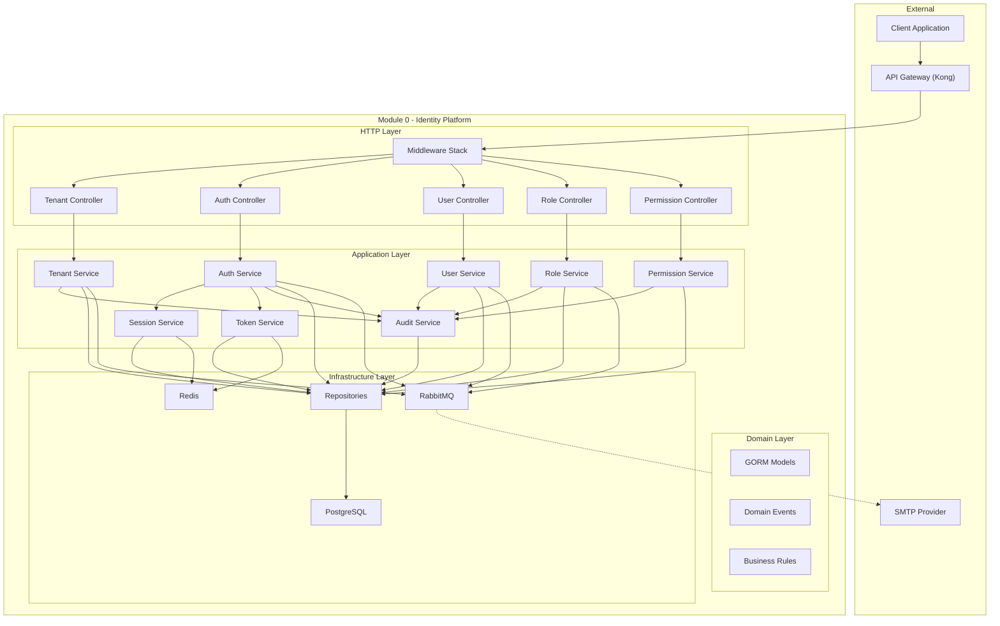
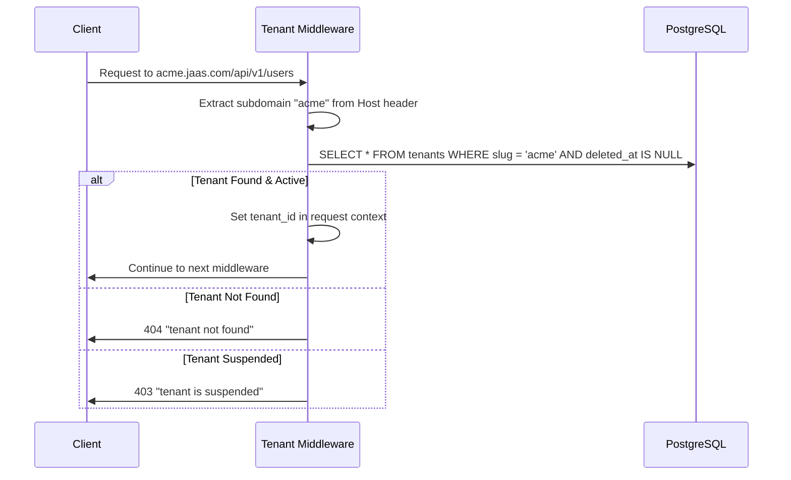
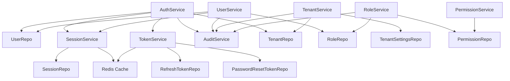
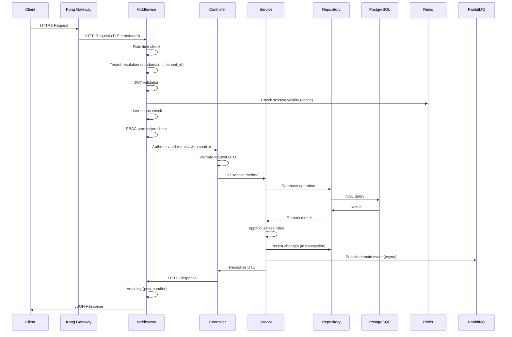
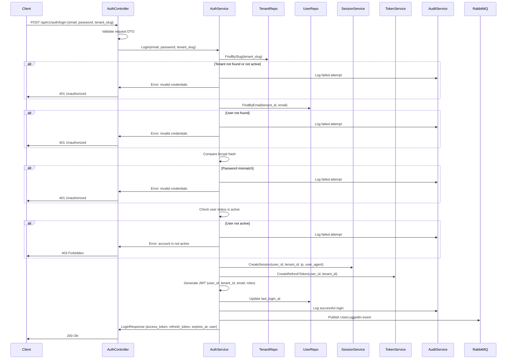
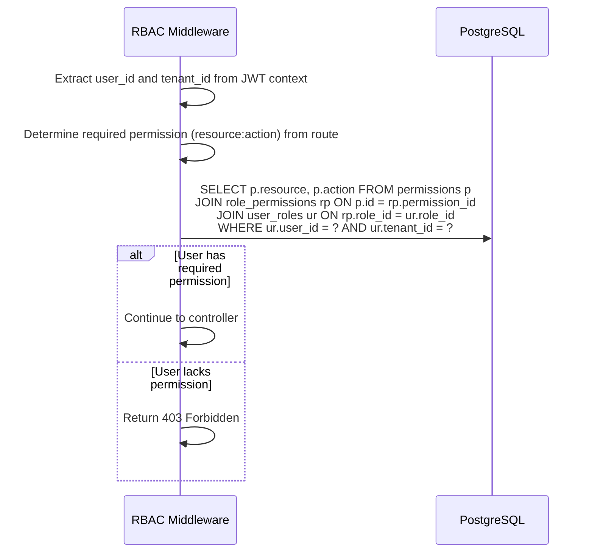
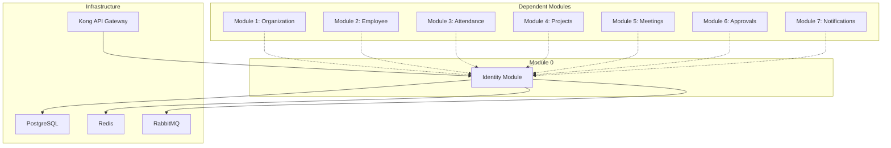

# Module 0 — System Architecture

## Component Overview

Module 0 is a self-contained identity platform composed of the following layers and components:

```
┌─────────────────────────────────────────────────────────────────────┐
│                          API Gateway (Kong)                         │
│                     TLS Termination + Routing                       │
└────────────────────────────────┬────────────────────────────────────┘
                                 │
                                 ▼
┌─────────────────────────────────────────────────────────────────────┐
│                        Go Application (Gin)                         │
│                                                                     │
│  ┌───────────────────────────────────────────────────────────────┐  │
│  │                     Middleware Stack                           │  │
│  │  CORS → RateLimit → TenantResolver → Auth → RBAC → Audit    │  │
│  └──────────────────────────┬────────────────────────────────────┘  │
│                              │                                      │
│  ┌──────────────────────────▼────────────────────────────────────┐  │
│  │                       Controllers                              │  │
│  │  TenantController │ AuthController │ UserController            │  │
│  │  RoleController   │ PermissionController                      │  │
│  └──────────────────────────┬────────────────────────────────────┘  │
│                              │                                      │
│  ┌──────────────────────────▼────────────────────────────────────┐  │
│  │                        Services                                │  │
│  │  TenantService │ AuthService │ UserService                     │  │
│  │  RoleService   │ PermissionService │ SessionService            │  │
│  │  AuditService  │ TokenService                                  │  │
│  └──────────────────────────┬────────────────────────────────────┘  │
│                              │                                      │
│  ┌──────────────────────────▼────────────────────────────────────┐  │
│  │                      Repositories                              │  │
│  │  TenantRepo │ UserRepo │ RoleRepo │ PermissionRepo             │  │
│  │  SessionRepo │ RefreshTokenRepo │ PasswordResetTokenRepo       │  │
│  │  MFAConfigRepo │ AuditLogRepo │ TenantSettingsRepo             │  │
│  └──────────────┬──────────────────────┬────────────────┬────────┘  │
│                  │                      │                │           │
│                  ▼                      ▼                ▼           │
│           ┌────────────┐       ┌──────────────┐  ┌────────────┐     │
│           │ PostgreSQL │       │    Redis      │  │  RabbitMQ  │     │
│           └────────────┘       └──────────────┘  └────────────┘     │
└─────────────────────────────────────────────────────────────────────┘
```

---

## Component Diagram



---

## Internal Engine Diagram

### Middleware Pipeline

Every HTTP request passes through the middleware stack in order:

```mermaid
graph LR
    A["Incoming Request"] --> B["CORS Middleware"]
    B --> C["Rate Limiter"]
    C --> D["Request Logger"]
    D --> E["Tenant Resolver"]
    E --> F["JWT Auth"]
    F --> G["User Status Check"]
    G --> H["RBAC Permission Check"]
    H --> I["Audit Logger"]
    I --> J["Controller Handler"]
```



| Middleware | Responsibility | Skipped For |
|-----------|---------------|-------------|
| **CORS** | Set CORS headers | Never |
| **Rate Limiter** | Enforce request rate limits per IP and per user | Never |
| **Request Logger** | Log request method, path, duration, status code | Never |
| **Tenant Resolver** | Extract subdomain → resolve tenant → inject `tenant_id` into context | Tenant management endpoints (Super Admin) |
| **JWT Auth** | Extract and validate JWT from `Authorization` header | Public endpoints (login, forgot-password, reset-password) |
| **User Status Check** | Verify user is still `active` and not soft-deleted | Public endpoints |
| **RBAC Permission Check** | Verify user has the required `resource:action` permission | Public endpoints, self-service endpoints |
| **Audit Logger** | Record the request in the audit log (post-handler, after response) | Read-only GET endpoints (configurable) |

### Tenant Resolution Flow



---

## Service Interactions

### Service Dependency Map



### Key Service Responsibilities

| Service | Responsibility |
|---------|---------------|
| **AuthService** | Orchestrates login, logout, refresh, forgot-password, reset-password. Coordinates between UserRepo, SessionService, TokenService. |
| **UserService** | User CRUD, invitation, deactivation. Validates role assignments. |
| **TenantService** | Tenant CRUD, activation, suspension. Manages tenant settings. |
| **RoleService** | Role CRUD. Manages role-permission and user-role assignments. |
| **PermissionService** | Read-only permission listing. |
| **SessionService** | Session creation, validation, revocation. Uses Redis for fast lookups. |
| **TokenService** | Refresh token and password reset token generation, validation, rotation. |
| **AuditService** | Audit log creation. Accepts audit entries from all other services. |

---

## Request Flow

### Standard Authenticated Request Flow



---

## Authentication Flow



---

## Authorization Flow



---

## Dependency Graph



---

## Database Interaction

### Connection Management

- Use GORM's built-in connection pooling
- Maximum open connections: 25
- Maximum idle connections: 10
- Connection max lifetime: 5 minutes
- Connection max idle time: 1 minute

### Transaction Strategy

| Operation | Transaction Required | Reason |
|-----------|---------------------|--------|
| Create User with Roles | Yes | Writes to `users` and `user_roles` |
| Delete Role | Yes | Deletes from `roles`, `user_roles`, and `role_permissions` |
| Login | Yes | Creates `session`, creates `refresh_token`, updates `last_login_at` |
| Reset Password | Yes | Updates `password_hash`, revokes all sessions and refresh tokens, marks token used |
| Deactivate User | Yes | Updates user status, revokes all sessions and refresh tokens |
| Suspend Tenant | No | Single row update |
| Create Audit Log | No | Single insert, best-effort |

### Query Patterns

All tenant-scoped queries MUST include `WHERE tenant_id = ?` to enforce isolation:

```sql
-- CORRECT: Tenant-scoped query
SELECT * FROM users WHERE tenant_id = $1 AND email = $2 AND deleted_at IS NULL

-- WRONG: Missing tenant isolation
SELECT * FROM users WHERE email = $1 AND deleted_at IS NULL
```

---

## Cache Interaction (Redis)

### Cache Strategy

| Data | Cache Key Pattern | TTL | Strategy |
|------|------------------|-----|----------|
| Session validity | `session:{session_id}` | 24 hours | Write-through on create, invalidate on revoke |
| User permissions | `perms:{user_id}:{tenant_id}` | 5 minutes | Cache-aside, invalidate on role/permission change |
| Rate limit counters | `rate:{ip}:{endpoint}` | 15 minutes | Sliding window counter |
| Token blacklist | `blacklist:{token_jti}` | 15 minutes (matches JWT TTL) | Write on logout/revoke |

### Cache Invalidation

| Event | Invalidated Keys |
|-------|-----------------|
| Logout | `session:{session_id}`, `blacklist:{jti}` (add) |
| User Deactivate | `session:{all_user_sessions}`, `perms:{user_id}:*` |
| Role Assign/Revoke | `perms:{user_id}:{tenant_id}` |
| Permission Assign/Revoke | `perms:{all_users_with_role}:{tenant_id}` |
| Tenant Suspend | `session:{all_tenant_sessions}` |

---

## Queue Interaction (RabbitMQ)

### Exchange Configuration

| Exchange | Type | Durable | Purpose |
|----------|------|---------|---------|
| `jaas.identity.events` | Topic | Yes | All Module 0 domain events |

### Queue Bindings

| Queue | Routing Key Pattern | Consumer |
|-------|-------------------|----------|
| `jaas.notifications.identity` | `identity.user.*` | Module 7 (Notifications) |
| `jaas.audit.identity` | `identity.#` | Audit archival service |
| `jaas.org.identity` | `identity.tenant.*`, `identity.user.created` | Module 1 (Organization) |

### Publishing Pattern

Events are published asynchronously after the database transaction commits. If RabbitMQ is unavailable:
1. Log the failure with full event payload
2. Store the failed event in a `failed_events` table (dead letter persistence)
3. A background worker retries failed events with exponential backoff

---

## Future Scalability Considerations

### Horizontal Scaling

- Module 0 is stateless (sessions in Redis, data in PostgreSQL). Multiple instances can run behind a load balancer.
- JWT validation is self-contained (no database hit for token verification itself), enabling high throughput.

### Database Scaling

- Read replicas for user/role/permission queries
- Partitioned audit logs by month for efficient querying and archival
- Connection pooling via PgBouncer for high-concurrency scenarios

### Cache Scaling

- Redis Cluster for high availability
- Separate Redis instance for rate limiting vs. session caching

### Event Processing

- Multiple queue consumers for parallel event processing
- RabbitMQ clustering for message durability
- Dead letter queues for poison message handling
