# MODULE 0 TECHNICAL AUDIT REPORT
**Target System:** JAAS (Company Operating System) — Module 0: Tenant + Identity + RBAC  
**Audit Date:** 2026-10-03  
**Audit Type:** Read-Only Technical Verification & Architecture Trace  
**Branch:** `backkendmod0` (Git commit `45477eb`)  
**Operating Environment:** Go 1.25.0, PostgreSQL 15 (Docker), Redis 7 (Docker), Next.js (Node.js)

---

## EXECUTIVE SUMMARY

A comprehensive, non-destructive technical audit of **Module 0 (Tenant + Identity + RBAC)** was conducted across the codebase, documentation, database migrations, configuration, test suites, and runtime environment.

### Key Audit Findings:
1. **Backend Implementation Completeness:** The core Go backend for Module 0 is **substantially complete and exceptionally well-tested**. All 12 PostgreSQL tables, 12 GORM models, 12 migrations, 22 REST endpoints, 10 domain event types, 5 middleware layers, and extensive security measures (AES-256-GCM encryption for MFA, atomic Lua-scripted rate limiting, token reuse detection, bcrypt cost 12 hashing) are implemented and functional.
2. **Frontend Scope Status:** The `frontend/` directory contains **only boilerplate Next.js scaffold with empty placeholder `.gitkeep` directories**. No UI forms, screens, state management, or API clients are implemented for Module 0. As clarified in user instructions, Module 0 execution was restricted to the backend and architecture.
3. **Automated Verification Status:**
   - **Internal Unit Tests:** `100% PASS` across all packages (`controllers`, `services`, `middleware`, `models`, `events`, `validators`, `shared/config`, `shared/crypto`, `shared/database`, `shared/errors`, `shared/middleware`, `shared/utils`).
   - **Repository Integration Tests (Live PostgreSQL):** `100% PASS` across all 12 repositories.
   - **API End-to-End Tests (Live PostgreSQL + Redis):** `100% PASS` across all 10 test suites (45 subtests).
   - **Security Tests (Live PostgreSQL + Redis):** `100% PASS` across all 8 test suites.
   - **Test Coverage:** Service layer achieves **97.5%**, controllers achieve **93.6%**, validators achieve **100%**, events achieve **100%**, middleware achieves **81.5%**.
4. **Architectural & Requirement Conflicts Identified:**
   - **Performance vs Security Budget Conflict (AC-PERF-001 vs NFR-SEC001):** Acceptance criteria specify that `POST /api/v1/auth/login` must respond in `< 300ms (p95)`. However, `security.md` mandates `bcrypt` with cost factor 12. On modern developer and test hardware, bcrypt cost 12 hashing alone consumes ~395ms of CPU time, yielding a login p95 of ~726ms. Thus, AC-PERF-001 fails because the two requirements are mathematically incompatible on single-core CPU throughput without lowering bcrypt cost or relaxing the p95 latency target.
   - **Tenant Route Authentication Discrepancy:** `api-contracts.md` and `NFR-SEC005` declare that `/api/v1/tenants` requires Super Admin JWT authentication. In `routes.go`, the `/api/v1/tenants` route group is mounted **without `authMiddleware`**, leaving tenant provisioning publicly reachable at the API level (under the assumption that an external API Gateway / Kong handles administrative routing).
   - **Unexposed Service Capabilities:** User invitation (`UserService.InviteUser`) and MFA configuration (`MFAConfigRepository` with AES-256-GCM cipher) are fully implemented and unit-tested in the service/data layer, but have no corresponding HTTP routes exposed in `routes.go` or `controllers`.

---

## 1. PROJECT DISCOVERY & REPOSITORY MAP

### High-Level Topology
```
JAAS Platform Root (C:\Users\yashwanth\Desktop\_AJASS)
├── .github/workflows/          # CI/CD Workflows (backend-ci.yml)
├── backend/                    # Go 1.25 Modular Monolith
│   ├── api/                    # OpenAPI / Swagger 2.0 specifications
│   ├── cmd/                    # Application Entry Points (main.go)
│   ├── configs/                # Environment configuration YAMLs
│   ├── deployments/            # Container & Deployment configurations
│   ├── internal/               # Private application code
│   │   ├── identity/           # MODULE 0: Identity, Tenant, RBAC domain
│   │   │   ├── controllers/    # Gin HTTP transport controllers
│   │   │   ├── dto/            # Request / Response Data Transfer Objects
│   │   │   ├── events/         # Domain Event structures & routing keys
│   │   │   ├── middleware/     # Identity-specific middlewares (Tenant, Auth, RBAC, Audit)
│   │   │   ├── models/         # GORM database entities
│   │   │   ├── repositories/   # Data access layer & interfaces
│   │   │   ├── routes/         # Route registrations & route groups
│   │   │   ├── services/       # Core business logic & workflows
│   │   │   └── validators/     # Custom request payload validation
│   │   ├── employee/           # MODULE 2: Employee skeleton (.gitkeep only)
│   │   ├── organization/       # MODULE 1: Organization skeleton (.gitkeep only)
│   │   └── shared/             # Platform-wide reusable shared components
│   │       ├── cache/          # Redis client implementation
│   │       ├── config/         # Viper-based configuration loader & validator
│   │       ├── constants/      # Shared constant definitions
│   │       ├── crypto/         # AES-256-GCM authenticated cipher
│   │       ├── database/       # PostgreSQL connection & GORM base models
│   │       ├── errors/         # Canonical error codes and AppError type
│   │       ├── logger/         # Zerolog structured logging
│   │       ├── middleware/     # Global middlewares (CORS, RateLimit, SecurityHeaders, RequestLogger)
│   │       ├── queue/          # RabbitMQ AMQP 0-9-1 publisher & NoOp fallback
│   │       └── utils/          # Validation helpers & reflection bridges
│   ├── migrations/             # 12 Up/Down SQL migration files
│   └── tests/                  # Integration, Security, and Performance test suites
│       ├── api/                # End-to-end API test suites
│       ├── perf/               # p95 latency & concurrency load tests
│       ├── security/           # Injection, rate limiting, token reuse tests
│       └── testhelper/         # Test fixtures, DB migration helpers, mock routers
├── docs/                       # Architectural & Specification Documentation
│   ├── adr/                    # Architecture Decision Records (.gitkeep)
│   ├── api/                    # API Documentation (.gitkeep)
│   ├── architecture/           # Platform Architecture (README.md)
│   ├── database/               # Database Architecture (.gitkeep)
│   └── modules/
│       └── module-0-identity/  # 18 comprehensive design & requirements specifications
├── frontend/                   # Next.js 15 Web Application Scaffold
│   ├── src/                    # Source tree (app, components, modules, stores)
│   └── public/                 # Static assets
├── docker-compose.yml          # Local container composition (Postgres, Redis, RabbitMQ, Backend, Frontend)
├── Makefile                    # Development & test orchestration targets
└── context01.md                # System-level product discovery & context
```

### Major Directory Analysis

| Directory | Purpose | Technology | Important Files | Dependencies | Relationship |
|---|---|---|---|---|---|
| `backend/cmd` | Application bootstrap and runtime lifecycle management | Go 1.25 | `main.go` | `internal/shared/*`, `internal/identity` | Boots DB, Redis, RabbitMQ, initializes Module 0, runs AutoMigrate, starts Gin HTTP server |
| `backend/internal/identity` | Complete domain boundary for Tenant, Identity, and RBAC | Go, Gin, GORM | `module.go`, `services/*`, `controllers/*`, `repositories/*`, `routes/routes.go` | `internal/shared/*`, external libraries (`jwt/v5`, `bcrypt`, `uuid`) | Implements all Module 0 use cases; isolates all identity concepts from future modules |
| `backend/internal/shared` | Platform kernel: persistence, caching, messaging, cross-cutting middlewares | Go, GORM, Redis, RabbitMQ, Zerolog | `database/base.go`, `crypto/aesgcm.go`, `middleware/rate_limiter.go`, `queue/rabbitmq.go` | `jackc/pgx`, `go-redis/v9`, `amqp091-go` | Injected into domain modules; provides uniform contracts and guarantees |
| `backend/migrations` | Canonical PostgreSQL schema migrations | Raw SQL (PostgreSQL 15) | `000001_create_tenants.up.sql` to `000012_create_audit_logs.up.sql` | PostgreSQL extensions (`uuid-ossp`) | Source of truth for database DDL; tested for strict bidirectional reversibility |
| `backend/tests` | Regression, security, integration, and load test suites | Go test, build tags (`integration`, `api`, `security`, `perf`) | `api/*`, `security/*`, `perf/*`, `testhelper/*` | Live Postgres (5432) & Redis (6379) | Validates acceptance criteria against running databases in isolated test environments |
| `frontend` | Web user interface scaffold | Next.js 15, React 19, TypeScript | `package.json`, `src/app/page.tsx` | Node.js, Next.js | Skeleton only; contains boilerplate page. No UI for Module 0 implemented |
| `docs/modules/module-0-identity` | Authoritative specifications, API contracts, sequence diagrams | Markdown, Mermaid, DBML | `requirements.md`, `acceptance-criteria.md`, `api-contracts.md`, `system-architecture.md`, `implementation-checklist.md` | None | Defines all functional, non-functional, security, and performance requirements |

---

## 2. ORIGINAL MODULE 0 REQUIREMENTS & CONFLICT ANALYSIS

Documents reviewed:
- `docs/modules/module-0-identity/requirements.md` (Functional & Non-Functional Specifications)
- `docs/modules/module-0-identity/acceptance-criteria.md` (66 concrete measurable criteria)
- `docs/modules/module-0-identity/api-contracts.md` (22 API endpoints with DTOs and envelopes)
- `docs/modules/module-0-identity/architecture-and-workflows.md` (Architectural diagrams & sequence flows)
- `docs/modules/module-0-identity/system-architecture.md` (Clean Architecture & layering patterns)
- `docs/modules/module-0-identity/security.md` (Security constraints, token lifetimes, encryption)
- `docs/modules/module-0-identity/events.md` (RabbitMQ event contracts and schemas)
- `docs/modules/module-0-identity/business-rules.md` (Domain invariants and edge case rules)
- `docs/modules/module-0-identity/implementation-checklist.md` (Phase-by-phase verification logs)
- `context01.md` (Product discovery overview)

### Document Conflicts & Ambiguities Identified:

1. **Conflict: Login Latency Target vs Bcrypt Cost 12**
   - *Source 1:* `requirements.md` (NFR-P003) & `acceptance-criteria.md` (AC-PERF-001) dictate: Login response time must be `< 300ms (p95)`.
   - *Source 2:* `security.md` (NFR-SEC001) mandates: Passwords must be hashed using bcrypt with cost factor 12.
   - *Reality on Code & Hardware:* Bcrypt cost 12 requires $2^{12} = 4096$ iterations of key expansion. On modern CPU architectures, single-threaded bcrypt at cost 12 takes between 350ms and 450ms. As measured during audit test execution (`TestPerf_LoginLatency`), bcrypt cost 12 alone takes **p50 = 395.4ms**, resulting in an overall login p95 of **726.5ms**. Both requirements cannot be met simultaneously on standard hardware.
2. **Conflict: Tenant Endpoint Authentication**
   - *Source 1:* `api-contracts.md` (lines 81-83) specifies `POST /api/v1/tenants` requires `Super Admin JWT` with `Authorization: Super Admin only`.
   - *Source 2:* `backend/internal/identity/routes/routes.go` mounts `tenants := router.Group("/tenants")` without any authentication middleware.
   - *Reality:* The tenant creation and listing endpoints in the Go binary are unauthenticated.
3. **Ambiguity: Frontend Scope for Module 0**
   - *Source 1:* `README.md` and `docs/architecture/README.md` show a Next.js frontend in the runtime topology communicating with `/api/v1`.
   - *Source 2:* `implementation-checklist.md` and `context01.md` scope Module 0 strictly as the backend foundation ("Tenant + Identity + RBAC Architecture").
   - *Reality:* Frontend is an empty scaffold (`.gitkeep`). No UI has been implemented.

---

## 3. RECONSTRUCTED MODULE 0 REQUIREMENTS CHECKLIST

### Functional Requirements

#### Tenant Management
- **REQ-001:** Create Tenant  
  - *Source:* `requirements.md` (FR-T001), `api-contracts.md`  
  - *Priority:* P0  
  - *Expected Behavior:* System shall create a tenant with name, unique slug, optional domain, and subscription plan.  
  - *Acceptance Criteria:* AC-API-001, AC-DB-004, AC-DB-005.
- **REQ-002:** Retrieve Single Tenant by ID  
  - *Source:* `requirements.md` (FR-T004)  
  - *Priority:* P1  
  - *Expected Behavior:* System returns tenant metadata by UUID.  
  - *Acceptance Criteria:* AC-API-003.
- **REQ-003:** List Tenants (Paginated)  
  - *Source:* `requirements.md` (FR-T005)  
  - *Priority:* P1  
  - *Expected Behavior:* Returns paginated list of tenants with page/per_page metadata.  
  - *Acceptance Criteria:* AC-API-002, AC-API-026.
- **REQ-004:** Partial Update Tenant  
  - *Source:* `requirements.md` (FR-T006)  
  - *Priority:* P1  
  - *Expected Behavior:* Allows updating name, domain, and plan.  
  - *Acceptance Criteria:* AC-API-004.
- **REQ-005:** Tenant Lifecycle (Activate / Suspend)  
  - *Source:* `requirements.md` (FR-T007, FR-T008)  
  - *Priority:* P0  
  - *Expected Behavior:* Suspend blocks login and tenant access; activate restores it.  
  - *Acceptance Criteria:* AC-API-005, AC-API-006, AC-AUTH-005, AC-EVT-002, AC-EVT-003.

#### Authentication & Session Management
- **REQ-006:** Password Authentication & Login  
  - *Source:* `requirements.md` (FR-A001..FR-A004)  
  - *Priority:* P0  
  - *Expected Behavior:* Authenticates user via email, password, and tenant slug; creates a session record; issues access JWT (15m) and rotating refresh token (7d).  
  - *Acceptance Criteria:* AC-API-007, AC-AUTH-001, AC-AUTH-002, AC-AUTH-015, AC-AUD-001.
- **REQ-007:** Token Refresh & Rotation  
  - *Source:* `requirements.md` (FR-A006, FR-A007)  
  - *Priority:* P0  
  - *Expected Behavior:* Issues new access and refresh token pair; revokes the used refresh token.  
  - *Acceptance Criteria:* AC-API-010, AC-AUTH-008.
- **REQ-008:** Refresh Token Reuse Detection  
  - *Source:* `security.md` (RT-005), `acceptance-criteria.md` (AC-AUTH-009)  
  - *Priority:* P0  
  - *Expected Behavior:* Presenting a previously revoked refresh token triggers immediate security revocation of all user sessions and refresh tokens.  
  - *Acceptance Criteria:* AC-AUTH-009, AC-SEC-009.
- **REQ-009:** Logout & Session Revocation  
  - *Source:* `requirements.md` (FR-A005, FR-S002)  
  - *Priority:* P0  
  - *Expected Behavior:* Revokes active session and refresh token; blacklists session in Redis.  
  - *Acceptance Criteria:* AC-API-009, AC-AUTH-007, AC-EVT-010.
- **REQ-010:** Password Reset Flow (Forgot & Reset)  
  - *Source:* `requirements.md` (FR-A008, FR-A009, BR-007)  
  - *Priority:* P1  
  - *Expected Behavior:* Forgot password silently issues 1-hour reset token and emits event. Reset password validates token, updates bcrypt hash, revokes all sessions.  
  - *Acceptance Criteria:* AC-API-011, AC-API-012, AC-AUTH-010..014, AC-SEC-005.

#### User Management & RBAC
- **REQ-011:** User Provisioning  
  - *Source:* `requirements.md` (FR-U001, FR-U002, FR-U008)  
  - *Priority:* P0  
  - *Expected Behavior:* Creates active user within tenant with hashed password, personal details, and optional role mappings.  
  - *Acceptance Criteria:* AC-API-013, AC-DB-006, AC-SEC-001, AC-EVT-004.
- **REQ-012:** User Directory & Profile Operations  
  - *Source:* `requirements.md` (FR-U003..FR-U005)  
  - *Priority:* P1  
  - *Expected Behavior:* Get user by ID, list users (paginated), and update profile fields.  
  - *Acceptance Criteria:* AC-API-014..016.
- **REQ-013:** User Deactivation  
  - *Source:* `requirements.md` (FR-U006, FR-S003)  
  - *Priority:* P0  
  - *Expected Behavior:* Sets user status to `inactive`, revokes all active sessions and refresh tokens.  
  - *Acceptance Criteria:* AC-API-017, AC-EVT-006, AC-AUD-004.
- **REQ-014:** Role CRUD & System Role Protection  
  - *Source:* `requirements.md` (FR-R001..FR-R006)  
  - *Priority:* P0  
  - *Expected Behavior:* Create, list, update, and delete tenant roles. Prevent deletion or renaming of system roles (`tenant_admin`).  
  - *Acceptance Criteria:* AC-API-018..021, AC-AUTHZ-004, AC-AUTHZ-005.
- **REQ-015:** Role & Permission Assignment  
  - *Source:* `requirements.md` (FR-R007, FR-R008)  
  - *Priority:* P0  
  - *Expected Behavior:* Assign permissions to roles and roles to users within tenant scope.  
  - *Acceptance Criteria:* AC-API-023, AC-API-024, AC-EVT-007, AC-EVT-008.
- **REQ-016:** Permission Catalog  
  - *Source:* `requirements.md` (FR-P001..FR-P003)  
  - *Priority:* P1  
  - *Expected Behavior:* Returns all globally defined resource:action permissions.  
  - *Acceptance Criteria:* AC-API-022.

#### Audit Logging
- **REQ-017:** Immutable Audit Trail  
  - *Source:* `requirements.md` (FR-AL001..FR-AL003)  
  - *Priority:* P0  
  - *Expected Behavior:* Records actor, tenant, action, resource, IP, user-agent, metadata. No updates or deletes allowed.  
  - *Acceptance Criteria:* AC-AUD-001..010, AC-DB-015.

---

## 4. REQUIREMENT-BY-REQUIREMENT VERIFICATION

| ID | Requirement | Status | Evidence | Files | Verification |
|---|---|---|---|---|---|
| **REQ-001** | Create Tenant | ✅ IMPLEMENTED | Validates slug regex, checks reserved words, ensures slug uniqueness, inserts tenant record, provisions default system roles (`tenant_admin`), publishes `TenantCreated` event. | `internal/identity/controllers/tenant_controller.go`<br/>`internal/identity/services/tenant_service.go`<br/>`internal/identity/repositories/tenant_repository.go` | Passed `TestAPI_Tenant/Create_Tenant` |
| **REQ-002** | Get Tenant by ID | ✅ IMPLEMENTED | Validates UUID, executes scoped query, returns standard envelope or 404. | `internal/identity/controllers/tenant_controller.go`<br/>`internal/identity/services/tenant_service.go` | Passed `TestAPI_Tenant/Get_Tenant_By_ID` |
| **REQ-003** | List Tenants (Paginated) | ✅ IMPLEMENTED | Supports `page` and `per_page` query parameters; returns items and pagination metadata (`total_items`, `total_pages`). | `internal/identity/controllers/tenant_controller.go`<br/>`internal/identity/services/tenant_service.go` | Verified via controller and service tests |
| **REQ-004** | Update Tenant | ✅ IMPLEMENTED | Supports partial update of name, domain, and plan. Re-validates domain format. | `internal/identity/controllers/tenant_controller.go`<br/>`internal/identity/services/tenant_service.go` | Passed `TestAPI_Tenant/Update_Tenant` |
| **REQ-005** | Activate / Suspend Tenant | ✅ IMPLEMENTED | Toggles status to `active`/`suspended`, logs audit trail, publishes `TenantActivated` and `TenantSuspended` events. Suspended tenants are blocked from authenticating. | `internal/identity/services/tenant_service.go`<br/>`internal/identity/services/auth_service.go` | Passed `TestAPI_Tenant/Suspend_and_Activate_Tenant` and `TestAPI_Auth/Login_SuspendedTenant` |
| **REQ-006** | User Authentication (Login) | ✅ IMPLEMENTED | Verifies tenant slug and status, validates user active status, verifies bcrypt cost 12 hash, creates session (15m TTL), issues HMAC-SHA256 JWT access token and 7-day opaque refresh token, updates `last_login_at`, logs audit entry, emits `UserLoggedIn` event. Rate limited to 10 per 15 min via Redis. | `internal/identity/controllers/auth_controller.go`<br/>`internal/identity/services/auth_service.go`<br/>`internal/shared/middleware/rate_limiter.go` | Passed `TestAPI_Auth/Login_Success` and `TestSecurity_RateLimit` |
| **REQ-007** | Token Refresh & Rotation | ✅ IMPLEMENTED | Hashes incoming raw token with SHA-256, looks up DB record, checks expiration, revokes old token, generates new access/refresh pair, persists new token. | `internal/identity/services/auth_service.go`<br/>`internal/identity/repositories/session_repository.go` | Passed `TestAPI_Auth/RefreshToken_Success` |
| **REQ-008** | Refresh Token Reuse Detection | ✅ IMPLEMENTED | If an already-revoked refresh token is presented (`rt.RevokedAt != nil`), it logs `token.reuse_detected`, revokes all active sessions for that user across the tenant, revokes all refresh tokens, and returns 401 `TOKEN_REUSED`. | `internal/identity/services/auth_service.go` | Passed `TestSecurity_TokenReuse/Refresh_Token_Rotation_and_Reuse_Block` |
| **REQ-009** | Logout & Session Revocation | ✅ IMPLEMENTED | Revokes session in PostgreSQL, revokes refresh token, writes blacklist entry to Redis with 15-minute TTL (`blacklist:session:<id>`), publishes `SessionRevoked` event. Subsequent requests with that token return 401. | `internal/identity/services/auth_service.go`<br/>`internal/identity/services/session_service.go` | Passed `TestAPI_Auth/Logout_Success` |
| **REQ-010** | Password Reset (Forgot & Reset) | ✅ IMPLEMENTED | `ForgotPassword` generates SHA-256 hashed 1-hour token, publishes event with raw token, returns 200 silently on nonexistent user to stop enumeration. `ResetPassword` checks token hash, expiration, single-use `used_at`, updates bcrypt hash, marks token used, and revokes all active sessions/tokens. | `internal/identity/services/auth_service.go`<br/>`internal/identity/repositories/password_reset_repository.go` | Passed `TestAPI_Auth/ForgotPassword_SilentSuccess` and `TestAPI_Auth/ResetPassword_Success` |
| **REQ-011** | User Creation | ✅ IMPLEMENTED | Checks tenant-scoped email uniqueness, generates bcrypt hash with cost 12, assigns optional roles, persists record, publishes `UserCreated` event, writes audit log. Protected by `users:create` permission and tenant context. | `internal/identity/controllers/user_controller.go`<br/>`internal/identity/services/user_service.go` | Passed `TestAPI_User/Create_User` |
| **REQ-012** | User Directory & Profile Operations | ✅ IMPLEMENTED | `GET /users/:id`, `GET /users`, `PATCH /users/:id` implemented with tenant isolation, permission checking (`users:read`, `users:update`), and audit logging. Password hash is omitted from all JSON DTO responses. | `internal/identity/controllers/user_controller.go`<br/>`internal/identity/services/user_service.go` | Passed `TestAPI_User/Get_User_By_ID`, `List_Users`, `Update_User` |
| **REQ-013** | User Deactivation | ✅ IMPLEMENTED | Sets status to `inactive`, revokes all user sessions and refresh tokens, publishes `UserDeactivated` event, writes audit log. Protected by `users:delete` permission. | `internal/identity/controllers/user_controller.go`<br/>`internal/identity/services/user_service.go` | Passed `TestAPI_User/Deactivate_User` |
| **REQ-014** | Role CRUD & System Role Protection | ✅ IMPLEMENTED | Creates tenant-scoped roles, validates name uniqueness within tenant. Update blocks renaming `tenant_admin` (403 `FORBIDDEN`). Delete blocks deleting system roles (403 `FORBIDDEN`). | `internal/identity/controllers/role_controller.go`<br/>`internal/identity/services/role_service.go` | Passed `TestAPI_Role/Create_Role`, `Update_Role`, `Delete_Role`, `SystemRole_Protection` |
| **REQ-015** | Role & Permission Assignment | ✅ IMPLEMENTED | `POST /roles/:id/permissions` binds permission UUIDs to role. `POST /users/:id/roles` binds role UUIDs to user. Both check tenant isolation and publish events (`PermissionAssigned`, `RoleAssigned`). | `internal/identity/controllers/role_controller.go`<br/>`internal/identity/services/role_service.go` | Passed `TestAPI_RBAC/Assign_Role_And_Check_Access` |
| **REQ-016** | Permission Catalog | ✅ IMPLEMENTED | `GET /api/v1/permissions` lists all global permissions. Authenticated endpoint; non-tenant_admin users are checked against `permissions:read`. | `internal/identity/controllers/permission_controller.go`<br/>`internal/identity/services/permission_service.go` | Passed `TestAPI_Permission/List_Permissions` |
| **REQ-017** | Audit Logging | ✅ IMPLEMENTED | Middleware `AuditLog` captures post-handler status (2xx only), user ID, tenant ID, action, resource, IP, user-agent, latency metadata. Table schema has NO `updated_at` or `deleted_at` columns. | `internal/identity/middleware/audit.go`<br/>`internal/identity/services/audit_service.go`<br/>`internal/identity/models/audit_log.go` | Passed `TestAPI_Audit/Verify_AuditTrail_Integrity` |
| **REQ-018** | User Invitation | 🟡 PARTIALLY IMPLEMENTED | `UserService.InviteUser` is implemented and unit tested (sets status `invited`, assigns random unusable dummy hash, emits `UserInvited` event). However, **no HTTP endpoint is exposed in `user_controller.go` or `routes.go`**. | `internal/identity/services/user_service.go` | Service logic verified by unit test; HTTP route missing |
| **REQ-019** | Multi-Factor Authentication (MFA) | 🟡 PARTIALLY IMPLEMENTED | `MFAConfigRepository` and AES-256-GCM encryption/decryption are fully implemented and integration-tested. Database table `mfa_configs` exists. However, **no HTTP endpoints exist to enroll or challenge MFA in Module 0**. | `internal/identity/repositories/mfa_config_repository.go`<br/>`internal/shared/crypto/aesgcm.go` | Integration tested in repository tier; API endpoints deferred |
| **REQ-020** | Tenant Subdomain Resolution | ✅ IMPLEMENTED | `TenantResolver` extracts subdomain from HTTP `Host` (e.g. `acme.jaas.com` or `acme.localhost`), queries DB, confirms active status, injects `tenant_id` into context. Missing subdomain returns 400. Suspended tenant returns 403. | `internal/identity/middleware/tenant.go` | Passed `TestAPI_TenantIsolation` |
| **REQ-021** | Cross-Tenant Isolation Enforcement | ✅ IMPLEMENTED | Every tenant-scoped repository query mandates `tenant_id`. `Authenticate` middleware verifies that JWT `tid` claim strictly equals the resolved subdomain `tenant_id`; mismatch returns 403 `FORBIDDEN`. User in Tenant A cannot query, update, or assign resources in Tenant B. | `internal/identity/middleware/auth.go`<br/>`internal/identity/repositories/*` | Passed `TestAPI_TenantIsolation/CrossTenant_AccessBlocked` |
| **REQ-022** | Rate Limiting | ✅ IMPLEMENTED | Redis-backed sliding window rate limiter implemented using an atomic Lua script (`rate_limiter.go`). Emits `X-RateLimit-Limit`, `X-RateLimit-Remaining`, `X-RateLimit-Reset`, and `Retry-After`. Applied to `/auth/login` (10/15m) and `/auth/forgot-password` (5/1h). | `internal/shared/middleware/rate_limiter.go` | Passed `TestSecurity_RateLimit` and `TestSecurity_RateLimitConcurrency` |
| **REQ-023** | Security Headers & CORS | ✅ IMPLEMENTED | Global middleware adds `X-Content-Type-Options: nosniff`, `X-Frame-Options: DENY`, `X-XSS-Protection: 1; mode=block`, and conditional `Strict-Transport-Security`. CORS enforces explicit origin matching (never wildcard with credentials). | `internal/shared/middleware/security_headers.go`<br/>`internal/shared/middleware/cors.go` | Passed `TestSecurity_Headers` |
| **REQ-024** | Login p95 Latency Target (< 300ms) | ❌ BROKEN / UNMET | Benchmark test `TestPerf_LoginLatency` yields p50 = 430.7ms and p95 = 726.5ms. Direct measurement reveals bcrypt cost 12 hashing alone consumes ~395ms of CPU time, exceeding the 300ms budget before database or network overhead. | `tests/perf/perf_test.go` | Failed `TestPerf_LoginLatency` due to requirement conflict with bcrypt 12 |
| **REQ-025** | Frontend User Interface | 🔴 NOT IMPLEMENTED | `frontend/src/modules/identity/` contains only `.gitkeep` files. `frontend/src/app/page.tsx` is an empty bootstrap placeholder. No login, tenant admin, or user management UI screens exist. | `frontend/src/*` | Verified by filesystem inspection |

---

## 5. REAL EXECUTION FLOW TRACES

### Workflow 1: Tenant Creation & Default System Role Provisioning

```
CLIENT (API Request)
  │
  │  POST /api/v1/tenants
  │  Payload: {"name": "Acme Corp", "slug": "acme", "domain": "acme.com", "plan": "pro"}
  ▼
API ROUTER (Gin Engine)
  │  Global Middleware: Recovery → RequestLogger → SecurityHeaders → CORS
  ▼
CONTROLLER (TenantController.Create)
  │  1. ShouldBindJSON(&req)
  │  2. ValidateStruct(req) -> validates regex ^[a-z][a-z0-9-]{1,62}[a-z0-9]$, slug != reserved
  │  3. Correlation ID generated: uuid.New()
  ▼
SERVICE (TenantService.CreateTenant)
  │  1. Check slug reserved list ("admin", "api", "billing", "system", etc.)
  │  2. Check slug uniqueness via TenantRepository.FindBySlug
  │  3. Check domain uniqueness via TenantRepository.FindByDomain
  │  4. In DB Transaction:
  │     a. Insert Tenant model (Status: "active")
  │     b. Create default system role "tenant_admin" (IsSystem: true, TenantID: tenant.ID)
  │     c. Associate role with tenant
  ▼
REPOSITORY / DATABASE (PostgreSQL)
  │  INSERT INTO "tenants" ("id", "name", "slug", "domain", "status", "plan", "created_at", ...)
  │  INSERT INTO "roles" ("id", "tenant_id", "name", "description", "is_system", ...)
  ▼
EVENT PUBLISHER & AUDIT LOG
  │  1. Publish domain event to RabbitMQ exchange "jaas.identity.events":
  │     Routing key: "identity.tenant.created", Type: "TenantCreated"
  │     (Fallback to NoOpPublisher if broker unavailable)
  │  2. Write immutable audit record to "audit_logs" table: action="tenant.created"
  ▼
RESPONSE ENVELOPE (HTTP 201 Created)
     {"data": {"id": "...", "name": "Acme Corp", "slug": "acme", "status": "active", ...}}
```
*Dead End / Anomaly:* `POST /api/v1/tenants` is not guarded by authentication middleware in `routes.go`. Any client can trigger tenant creation.

---

### Workflow 2: User Login & Session Establishment

```
CLIENT (Browser / API Client)
  │
  │  POST /api/v1/auth/login
  │  Payload: {"tenant_slug": "acme", "email": "admin@acme.com", "password": "Password123!"}
  ▼
MIDDLEWARE STACK
  │  1. RequestLogger (assigns X-Request-ID)
  │  2. RateLimiter (Redis EVALSHA Lua script; checks key "ratelimit:auth:login:<ip>")
  │     - If count > 10 in 15min window: returns 429 Too Many Requests with Retry-After header.
  ▼
CONTROLLER (AuthController.Login)
  │  c.ClientIP(), c.Request.UserAgent(), c.ShouldBindJSON(&req)
  ▼
SERVICE (AuthService.Login)
  │  1. TenantRepository.FindBySlug("acme") -> if nil: returns 401 Invalid Credentials
  │  2. Check tenant.Status == "suspended" -> if true: returns 403 Tenant Suspended
  │  3. UserRepository.FindByEmail(tenant.ID, "admin@acme.com") -> if nil: returns 401 Invalid Credentials
  │  4. Check user.Status != "active" -> if true: returns 403 Account Not Active
  │  5. bcrypt.CompareHashAndPassword(user.PasswordHash, req.Password)
  │     - If mismatch: logs "login.failed" audit entry, returns 401 Invalid Credentials
  │  6. SessionService.CreateSession -> creates DB session (ExpiresAt: now + 15m)
  │  7. TokenService.GenerateOpaqueToken -> generates crypto-random string & SHA-256 hash
  │  8. RefreshTokenRepository.Create -> persists refresh token record (ExpiresAt: now + 7d)
  │  9. UserRoleRepository.FindByUserID -> loads user roles
  │  10. TokenService.GenerateAccessToken -> signs JWT HS256 with claims:
  │      sub: user.ID, tid: tenant.ID, email, roles, sid: session.ID, exp: now + 15m
  │  11. UserRepository.Update -> updates user.LastLoginAt
  ▼
EVENT PUBLISHER & AUDIT LOG
  │  1. Publishes "UserLoggedIn" event (key: "identity.user.login_success")
  │  2. Logs "login.success" to "audit_logs" with session ID metadata
  ▼
RESPONSE ENVELOPE (HTTP 200 OK)
     {
       "data": {
         "access_token": "eyJhbGciOi...",
         "refresh_token": "9f8a7c2b...",
         "expires_at": 1727918400,
         "user": {"id": "...", "email": "...", "first_name": "...", "roles": [...]}
       }
     }
```

---

### Workflow 3: Token Refresh & Reuse Detection

```
CLIENT
  │
  │  POST /api/v1/auth/refresh
  │  Payload: {"refresh_token": "9f8a7c2b..."}
  ▼
CONTROLLER (AuthController.Refresh) -> SERVICE (AuthService.RefreshToken)
  │  1. Hash incoming token with SHA-256
  │  2. RefreshTokenRepository.FindByTokenHash(hash)
  │     - If not found or expired: returns 401 Unauthorized
  │  3. SECURITY CHECK: rt.RevokedAt != nil?
  │     ├── YES (Token Reuse Detected):
  │     │   a. AuditLog: action="token.reuse_detected"
  │     │   b. SessionService.RevokeAllForUser(tenantID, userID)
  │     │   c. RefreshTokenRepository.RevokeAllByUserID(tenantID, userID)
  │     │   d. Returns 401 "TOKEN_REUSED: All sessions invalidated" [TERMINATE]
  │     └── NO (Valid Token):
  │         a. Verify User is active and Tenant is active
  │         b. Revoke old refresh token (sets revoked_at = now)
  │         c. Generate new opaque token and SHA-256 hash
  │         d. Create new RefreshToken record in PostgreSQL
  │         e. Create new active Session record (15m TTL)
  │         f. Generate new JWT access token (15m TTL)
  ▼
RESPONSE ENVELOPE (HTTP 200 OK)
     {"data": {"access_token": "new.jwt...", "refresh_token": "new.raw.token...", "expires_at": ...}}
```

---

### Workflow 4: Authenticated & RBAC-Protected Request Execution

```
CLIENT
  │  GET /api/v1/users/81a74164-ab98-41b9-a203-56f792ebc939
  │  Host: acme.jaas.com
  │  Header: Authorization: Bearer <jwt>
  ▼
1. TENANT RESOLVER MIDDLEWARE
  │  Extracts subdomain "acme" from Host header
  │  Finds Tenant by slug in PostgreSQL; checks status == "active"
  │  c.Set("tenant_id", tenant.ID); c.Set("tenant", tenant)
  ▼
2. AUTHENTICATE MIDDLEWARE
  │  Extracts and parses Bearer JWT token
  │  Validates HS256 signature and expiration
  │  Validates session ID:
  │    - Checks Redis blacklist ("blacklist:session:<session_id>")
  │    - Checks PostgreSQL session record (revoked_at IS NULL and expires_at > now)
  │  TENANT ISOLATION CHECK:
  │    - Verifies token claims.TenantID == context tenant_id
  │    - If mismatch: aborts 403 Forbidden "Access to this tenant subdomain is denied"
  │  c.Set("user_id", ...); c.Set("roles", ...)
  ▼
3. REQUIRE PERMISSION MIDDLEWARE (resource="users", action="read")
  │  Checks context roles:
  │    - If role includes "tenant_admin": BYPASS check, proceed immediately
  │    - Else: loads UserRoles and RolePermissions from DB
  │      Verifies existence of permission with resource="users" and action="read"
  │      - If absent: aborts 403 Forbidden "You do not have permission"
  ▼
4. CONTROLLER & SERVICE
  │  UserController.GetByID -> UserService.GetByID(ctx, db, tenantID, userID)
  │  UserRepository.FindByID filters by BOTH tenant_id AND user_id:
  │    SELECT * FROM users WHERE tenant_id = ? AND id = ? AND deleted_at IS NULL
  ▼
5. AUDIT LOG MIDDLEWARE (Deferred execution on return)
  │  Post-request hook intercepts 200 response
  │  Writes audit entry to PostgreSQL with user_id, tenant_id, path, IP, user agent
  ▼
RESPONSE ENVELOPE (HTTP 200 OK)
     {"data": {"id": "...", "email": "...", "first_name": "...", ...}}
```

---

### Workflow 5: Password Reset Lifecycle

```
PHASE 1: Forgot Password
  Client: POST /api/v1/auth/forgot-password {"tenant_slug": "acme", "email": "user@acme.com"}
  RateLimiter: Checks Redis (max 5 requests per 1 hour)
  AuthService.ForgotPassword:
    - Resolves tenant and user.
    - If tenant or user is missing: returns 200 OK immediately (anti-enumeration).
    - If user exists:
      Generates 32-byte crypto token; calculates SHA-256 hash.
      Inserts PasswordResetToken into DB (ExpiresAt: now + 1 hour).
      Publishes event "PasswordResetRequested" (routing key: identity.password.reset_requested)
      Payload includes raw token for downstream SMTP email delivery.
      Writes audit log.
  Client receives 200 OK {"data": {"message": "If the email is registered..."}}.

PHASE 2: Reset Password
  Client: POST /api/v1/auth/reset-password {"token": "<raw_token>", "new_password": "NewSecretPassword123!"}
  AuthService.ResetPassword:
    - Hashes raw token with SHA-256; queries DB.
    - If token not found: returns 400 INVALID_TOKEN.
    - If token.UsedAt != nil: returns 400 TOKEN_ALREADY_USED.
    - If token.ExpiresAt < now: returns 400 TOKEN_EXPIRED.
    - Generates new bcrypt hash with cost 12.
    - Updates user.PasswordHash in DB.
    - Updates password_reset_tokens SET used_at = now.
    - Revokes ALL sessions for user in DB.
    - Revokes ALL refresh tokens for user in DB.
    - Publishes "PasswordResetCompleted" event.
    - Writes audit log.
  Client receives 200 OK.
```

---

## 6. VERIFIED SYSTEM ARCHITECTURE

### Verified Architecture Breakdown

#### Frontend Application
- **Framework:** Next.js 15.1.7 (React 19, TypeScript).
- **Current State:** **Scaffolding only**. All subdirectories in `frontend/src/modules/` contain exclusively `.gitkeep` files. `frontend/src/app/page.tsx` renders a plain static `<h1>JAAS Platform</h1>` tag.
- **Routing & State:** Next.js App Router configured, but no application routes or Zustand stores created.

#### Backend Application
- **Language & Runtime:** Go 1.25.0 (`go.mod`).
- **HTTP Engine:** Gin Web Framework (`github.com/gin-gonic/gin` v1.12.0).
- **Architectural Style:** Clean Architecture / Hexagonal Ports & Adapters organized as a Modular Monolith.
- **Routing Architecture:** Base path `/api/v1`. Subdomain resolution middleware enforces tenant isolation on tenant-scoped groups (`/users`, `/roles`). Global routes `/tenants`, `/auth`, `/permissions`.
- **Validation:** Standardized struct binding via Gin and custom validation routines (`github.com/go-playground/validator/v10`).
- **Configuration:** Viper-based environment loader (`configs/development.yaml`, `configs/production.yaml`). Supports fail-fast validation refusing to boot in production with weak secrets or insecure CORS.
- **Logging:** Structured JSON logging via Zerolog (`github.com/rs/zerolog` v1.35.1) with correlation IDs and HTTP request metrics.

#### Database & Persistence
- **Engine:** PostgreSQL 15 (Docker container `ajass-postgres-1`).
- **ORM:** GORM (`gorm.io/gorm` v1.31.2) over `jackc/pgx/v5`.
- **Tables (12 verified in live DB):**
  1. `tenants`: Primary customer organizations. Unique indexes on `slug` and `domain`. Soft deletes (`deleted_at`).
  2. `users`: Tenant users. Unique composite index on `(tenant_id, email)`. Soft deletes.
  3. `roles`: Tenant roles. Unique composite index on `(tenant_id, name)`. Soft deletes. System roles flag (`is_system`).
  4. `permissions`: Global resource:action catalog. Unique composite index on `(resource, action)`.
  5. `user_roles`: Join table. Unique composite index on `(user_id, role_id, tenant_id)`.
  6. `role_permissions`: Join table. Unique composite index on `(role_id, permission_id, tenant_id)`.
  7. `sessions`: HTTP session tracking with `ip_address`, `user_agent`, `expires_at`, `revoked_at`.
  8. `refresh_tokens`: Opaque token store with unique `token_hash`, `expires_at`, `revoked_at`.
  9. `password_reset_tokens`: Unique `token_hash`, `expires_at`, `used_at`.
  10. `mfa_configs`: MFA credentials. Unique on `(user_id, type)`. AES-256-GCM encrypted secrets.
  11. `tenant_settings`: Key-value store. Unique on `(tenant_id, key)`.
  12. `audit_logs`: Immutable audit trail. UUID PK, tenant_id, user_id, action, resource, metadata (JSONB). No `updated_at` or `deleted_at`.
- **Migrations:** 12 up/down SQL migrations tested for full bidirectional reversibility.

#### Caching & In-Memory State
- **Engine:** Redis 7 (Docker container `ajass-redis-1`).
- **Use Cases:**
  1. Atomic rate limiting via Lua scripting (`rate_limiter.go`).
  2. Session revocation blacklist (`blacklist:session:<session_id>`) with 15-minute TTL.

#### Message Broker & Events
- **Engine:** RabbitMQ 3 (`rabbitmq:3-management-alpine`).
- **Exchange:** Topic exchange `jaas.identity.events`.
- **Publisher:** `RabbitMQPublisher` with amqp091-go, auto-reconnection loop, publisher confirmations, and fallback to `NoOpPublisher`.
- **Event Types:** 10 domain events (`TenantCreated`, `TenantActivated`, `TenantSuspended`, `UserCreated`, `UserInvited`, `UserDeactivated`, `UserLoggedIn`, `RoleAssigned`, `PermissionAssigned`, `PasswordResetRequested`).

---

## 7. VERIFIED ARCHITECTURE DIAGRAM

The following Mermaid diagram represents the **verified system as implemented in the repository**:

```mermaid
flowchart TB
    %% Styling Classes
    classDef clientLayer fill:#E1F5FE,stroke:#039BE5,stroke-width:2px,color:#01579B;
    classDef edgeLayer fill:#EDE7F6,stroke:#7E57C2,stroke-width:2px,color:#311B92;
    classDef middlewareLayer fill:#FFF3E0,stroke:#FB8C00,stroke-width:2px,color:#E65100;
    classDef controllerLayer fill:#FFEBEE,stroke:#E53935,stroke-width:2px,color:#B71C1C;
    classDef serviceLayer fill:#E8F5E9,stroke:#43A047,stroke-width:2px,color:#1B5E20;
    classDef repoLayer fill:#F3E5F5,stroke:#8E24AA,stroke-width:2px,color:#4A148C;
    classDef infraLayer fill:#ECEFF1,stroke:#546E7A,stroke-width:2px,color:#263238;
    classDef deadEnd fill:#FFCDD2,stroke:#C62828,stroke-width:2px,stroke-dasharray: 5 5,color:#B71C1C;

    subgraph Client ["Client / Ingress Tier"]
        Browser["HTTP Client / Browser<br/>(Next.js Frontend Scaffold - No UI)"]:::clientLayer
    end

    subgraph Edge ["Edge & Reverse Proxy (Planned)"]
        Gateway["API Gateway / Kong<br/>TLS Termination & Subdomain Routing"]:::edgeLayer
    end

    subgraph BackendApp ["JAAS Backend (Go 1.25 Modular Monolith)"]
        
        subgraph GlobalMW ["Global Middlewares"]
            ReqLogger["RequestLogger (Zerolog)"]:::middlewareLayer
            SecHeaders["SecurityHeaders"]:::middlewareLayer
            CORS["CORS Handler"]:::middlewareLayer
        end

        subgraph RouteMW ["Route-Specific Middlewares"]
            RateLimit["RateLimiter (Redis Lua)"]:::middlewareLayer
            TenantRes["TenantResolver (Subdomain)"]:::middlewareLayer
            AuthMW["Authenticate (JWT + Session)"]:::middlewareLayer
            RBACGuard["RequirePermission (RBAC)"]:::middlewareLayer
            AuditMW["AuditLog Hook"]:::middlewareLayer
        end

        subgraph Controllers ["Gin HTTP Controllers"]
            TenantCtrl["TenantController<br/>/api/v1/tenants"]:::controllerLayer
            AuthCtrl["AuthController<br/>/api/v1/auth/*"]:::controllerLayer
            UserCtrl["UserController<br/>/api/v1/users/*"]:::controllerLayer
            RoleCtrl["RoleController<br/>/api/v1/roles/*"]:::controllerLayer
            PermCtrl["PermissionController<br/>/api/v1/permissions"]:::controllerLayer
        end

        subgraph Services ["Core Domain Services"]
            TenantSvc["TenantService"]:::serviceLayer
            AuthSvc["AuthService"]:::serviceLayer
            UserSvc["UserService"]:::serviceLayer
            RoleSvc["RoleService"]:::serviceLayer
            PermSvc["PermissionService"]:::serviceLayer
            SessionSvc["SessionService"]:::serviceLayer
            TokenSvc["TokenService (JWT + Crypto)"]:::serviceLayer
            AuditSvc["AuditService"]:::serviceLayer
        end

        subgraph Repositories ["GORM Repositories"]
            TenantRepo["TenantRepository"]:::repoLayer
            UserRepo["UserRepository"]:::repoLayer
            RoleRepo["RoleRepository"]:::repoLayer
            PermRepo["PermissionRepository"]:::repoLayer
            UserRoleRepo["UserRoleRepository"]:::repoLayer
            RolePermRepo["RolePermissionRepository"]:::repoLayer
            SessionRepo["SessionRepository"]:::repoLayer
            TokenRepo["RefreshTokenRepository"]:::repoLayer
            ResetRepo["PasswordResetTokenRepository"]:::repoLayer
            MFARepo["MFAConfigRepository<br/>(AES-256-GCM Cipher)"]:::repoLayer
            AuditRepo["AuditLogRepository"]:::repoLayer
        end
    end

    subgraph Storage ["Stateful Infrastructure Tier"]
        Postgres[("🐘 PostgreSQL 15<br/>12 Tables, UUID PKs<br/>Tenant Scoping")]:::infraLayer
        Redis[("⚡ Redis 7<br/>Rate Limiting Counters<br/>Session Blacklist (15m TTL)")]:::infraLayer
        RabbitMQ[("🐇 RabbitMQ 3 Broker<br/>Exchange: jaas.identity.events<br/>(Fallback: NoOpPublisher)")]:::infraLayer
    end

    subgraph Unwired ["Unexposed Service Logic"]
        InviteDeadEnd["UserService.InviteUser<br/>(Logic implemented, no HTTP route)"]:::deadEnd
        MFADeadEnd["MFAConfigRepository<br/>(Cipher implemented, no HTTP route)"]:::deadEnd
    end

    %% Wiring Connections
    Browser --> Gateway
    Gateway --> ReqLogger --> SecHeaders --> CORS

    %% Route Dispatches
    CORS -->|Public / Global| TenantCtrl
    CORS -->|Public Rate Limited| RateLimit --> AuthCtrl
    CORS -->|Requires Subdomain + JWT| TenantRes --> AuthMW --> RBACGuard

    RBACGuard --> UserCtrl
    RBACGuard --> RoleCtrl
    AuthMW --> PermCtrl
    AuthMW -->|Auth Protected| AuthCtrl

    %% Controller -> Service
    TenantCtrl --> TenantSvc
    AuthCtrl --> AuthSvc
    UserCtrl --> UserSvc
    RoleCtrl --> RoleSvc
    PermCtrl --> PermSvc

    %% Service -> Auxiliary Services
    AuthSvc --> SessionSvc
    AuthSvc --> TokenSvc
    AuthSvc --> AuditSvc
    UserSvc --> AuditSvc
    TenantSvc --> AuditSvc
    RoleSvc --> AuditSvc

    %% Service -> Repositories
    TenantSvc --> TenantRepo
    AuthSvc --> UserRepo & SessionRepo & TokenRepo & ResetRepo
    UserSvc --> UserRepo & RoleRepo & UserRoleRepo & SessionRepo
    RoleSvc --> RoleRepo & PermRepo & UserRoleRepo & RolePermRepo
    PermSvc --> PermRepo
    SessionSvc --> SessionRepo
    AuditSvc --> AuditRepo

    %% Data Store Access
    Repositories --> Postgres
    SessionSvc -->|Blacklist Check & Set| Redis
    RateLimit -->|Atomic Sliding Window| Redis
    TenantSvc & AuthSvc & UserSvc & RoleSvc -->|Publish Domain Events| RabbitMQ

    %% Post-handler Audit
    UserCtrl & RoleCtrl -.->|Post-response hook| AuditMW --> AuditSvc

    %% Unexposed
    UserSvc -.- InviteDeadEnd
    MFARepo -.- MFADeadEnd
```



---

## 8. ACTIONABLE RECOMMENDATIONS FOR MODULE 1 READINESS

Before progressing into **Module 1 (Organization Service)**:

1. **Resolve the Login Latency / Bcrypt Conflict:**
   - Formalize the product decision: Either adjust the login p95 latency target from `< 300ms` to `< 800ms` in `acceptance-criteria.md` and `requirements.md` (recommended to retain bcrypt cost 12 security posture), OR reduce bcrypt cost from 12 to 11.
2. **Secure the `/api/v1/tenants` Route Group:**
   - Attach an authentication/authorization middleware or API-gateway validation header check to `/api/v1/tenants` so that unauthorized actors cannot create or suspend tenants.
3. **Expose Missing Endpoints:**
   - Mount `POST /api/v1/users/invite` in `user_controller.go` to surface the existing `UserService.InviteUser` business logic.
   - If MFA enrollment is desired prior to enterprise modules, expose routes for `MFAConfigRepository`.
4. **Frontend Implementation:**
   - Decide whether Module 0 UI (Login screen, Tenant admin dashboard, User profile manager) should be built before Module 1 or bundled into a dedicated frontend sprint.
